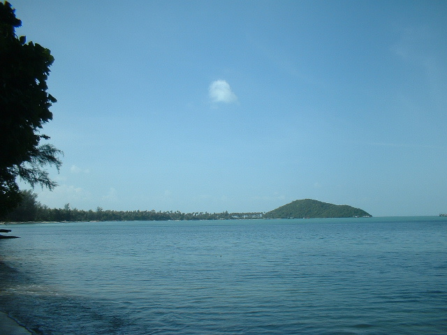
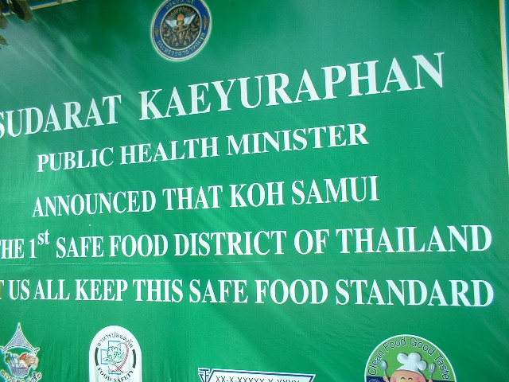
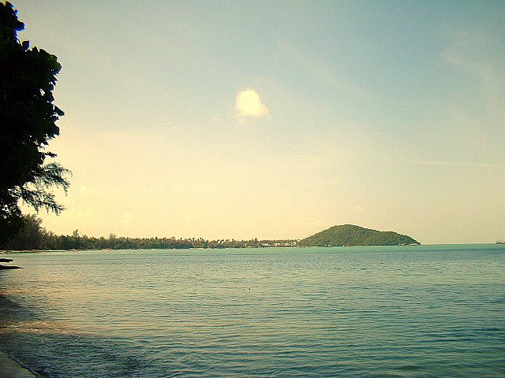
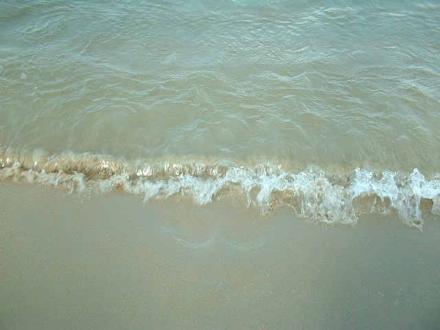

So. Am Wochenende hatte ich mich dann nun zur versprochenen Inselrundfahrt aufgeschwungen. Ich bin gleich 9 Uhr losgedüst, weil ich nicht unbedingt die ganze Zeit in der größten Hitze fahren wollte. Das war eine gute Entscheidung. Es gab wenig Verkehr und man konnte öfter mal stehen bleiben um Bilder wie das folgende zu schießen.

Im Süden der Insel sind mehr die ländlichen Gebiete, die weniger auf Touristenunterkünfte ausgerichtet sind. Viele Attraktionen haben sie schon (Wasserfälle, Elephanten- und Schlangenshows usw.) aber weniger Unterkünfte und dicht besiedelte Gegenden.

Dafür ist Koh Samui das Safe-Food-District Nummer 1 Thailands. Auch gut zu wissen. Gestern abend war ich knapp davor, einem der Straßenhändler solche lecker riechenden verkrustet gebratenen komischen Etwasse abzukaufen. Aber noch war die Vorsicht größer.

Wenn man ganz genau sucht, findet man auch die Kalenderfotoplätze. Muss nur noch eine bessere Kamera her.

Und wie man im folgenden Bild von der Welle verwaschen nur noch schemenhaft erkennen kann --- ja, ich habe meine Füße ins Chinesische Meer getaucht. Mission accomplished.

Jedenfalls sind es 87 Kilometer, wenn man die "Ringstraße" fährt und alle halbwegs ausgebauten Straßen dazunimmt, die ein wenig weiter um die Ringstraße gehen. Verfährt man sich dann und wann noch ein wenig, kann man viel Spaß haben und einen gut verbrachten Tag erleben.
