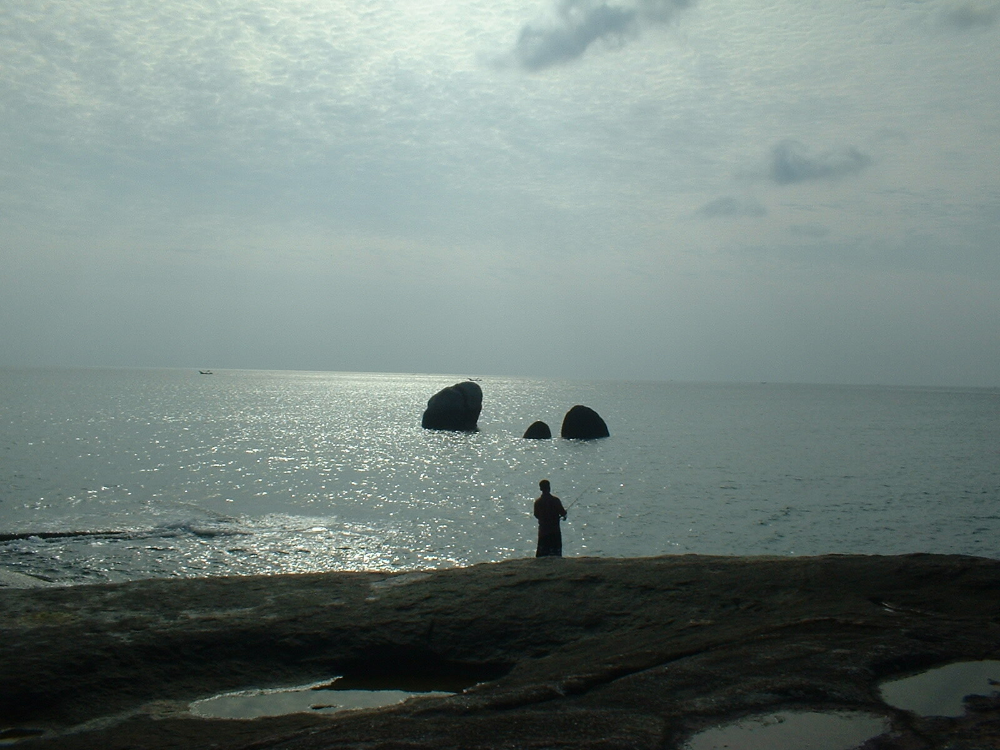

Nu isses also vorbei. Das alte Jahr. Das neue wird kommen (führt kein Weg dran vorbei und schon Nostradamus, die Zeugen Jehovas und alle Jahr 2000ler haben es nicht geschafft, daran was zu ändern) und alles wird schöner, besser, größer und überhaupt. Wir nehmen uns eine Menge Gutes vor und halten uns mindestens eine Woche daran. Meine Vorsätze sind "kein Alkohol und kein Säugetierfleisch in 2006" und "mehr Slow Motion" (das erklär ich mal später).

Bleibt mir nur Dir wertem Leser je nach Zelebrationsform des Tages einen guten Rutsch oder einen geruhsamen Jahresausklang zu wünschen. Im Neuen Jahr wird alles schöner, besser, größer und überhaupt.

Was macht ihr mit eurer [Extra-Sekunde][2]? Ich denke, ich werde stumpf in der Gegend rum starren und damit meine Kritik an der Konsumgesellschaft ausdrücken. Wenn wir alle nicht so monetär orientiert wären, würde unsere Erde nicht so aus dem Takt geraten. Glaubt mir. Geld ist aus Metall gestrickt. Oder ich werde schlafen. Mal sehen.

PS: Ich vermisse meinen Dezemberlohn.

 [2]: https://web.archive.org/web/20051230070058/http://www.netzeitung.de/wissenschaft/374596.html

<!-- grammar-ignore ERSTE_PERSON_SIN_OHNE_E erklär -->
<!-- grammar-ignore DE_DU_UPPER_LOWER eurer -->
<!-- cspell:ignore isses -->
<!-- cspell:ignore Säugetierfleisch -->
<!-- cspell:ignore Zelebrationsform -->
