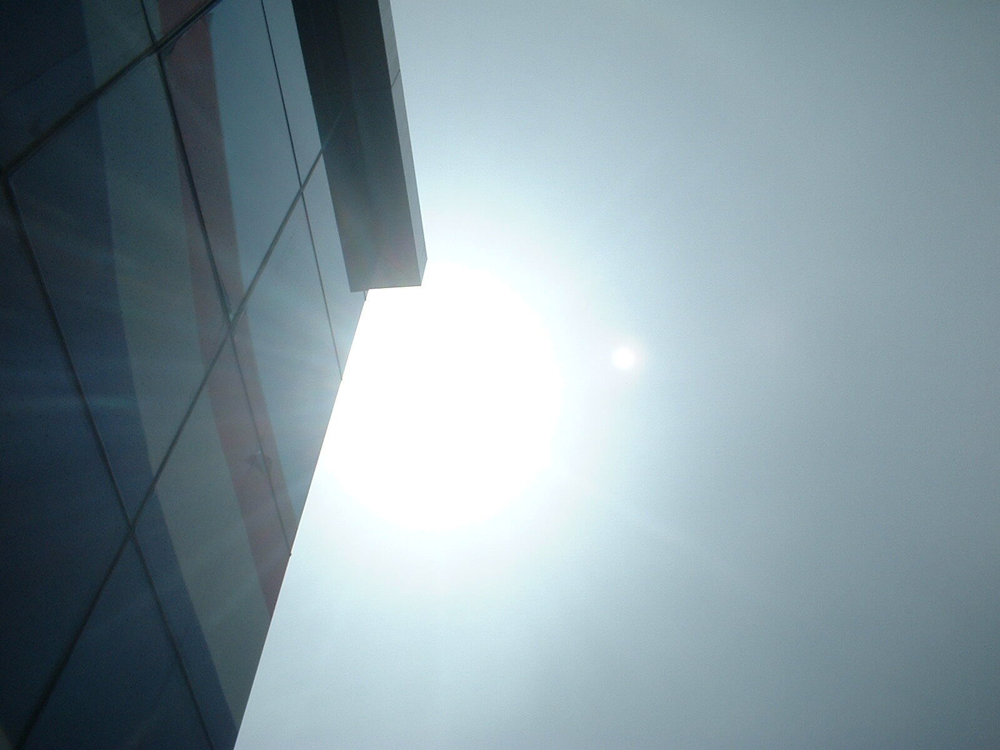

Mit höhnischem Grinsen hat sich vor ca. 30 Minuten die Sonne aufmacht, uns sich im Trockenen wähnen zu lassen.

Ich glaubs erst, wenn ich trocken nach Hause komme. Wenn man bedenkt, dass ich tropfender Klamotten beschwert das Büro heute Morgen nach einer Flutungsfahrt ohnegleichen erreichte ist es doch eher Hohn als ehrlich gemeinte UV-Strahlung.

Bitch. Würde ich mal sagen. In den meisten Sprachen dieser Welt ist die Sonne … ehm … ich arbeite mal eben weiter …

<!-- cspell:ignore glaubs -->
<!-- cspell:ignore Flutungsfahrt -->
