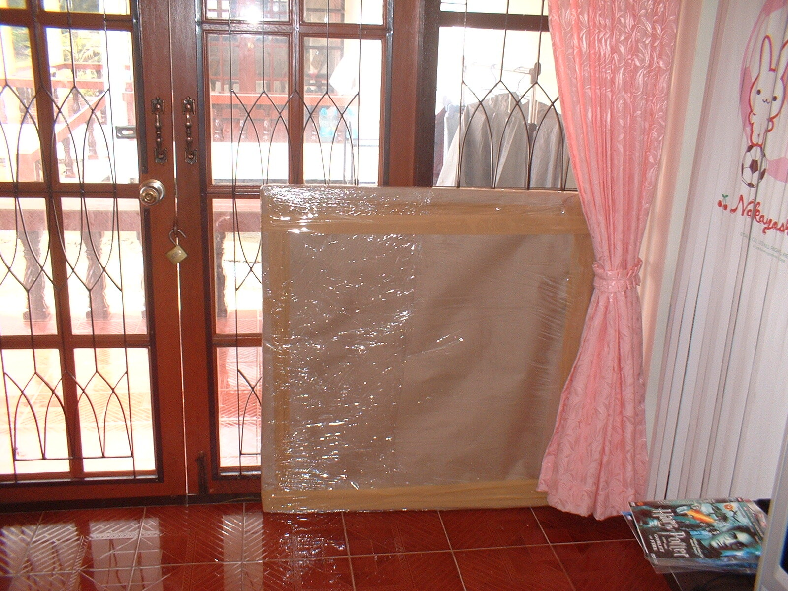

Dass ich Weihnachten nicht feiere heisst nicht, dass ich mir nichts schenken kann. Ich schenk mir zur Zeit regelmässig was, aber sowas Grosses schon lange nicht mehr.

<!-- grammar-ignore ERSTE_PERSON_SIN_OHNE_E schenk -->
