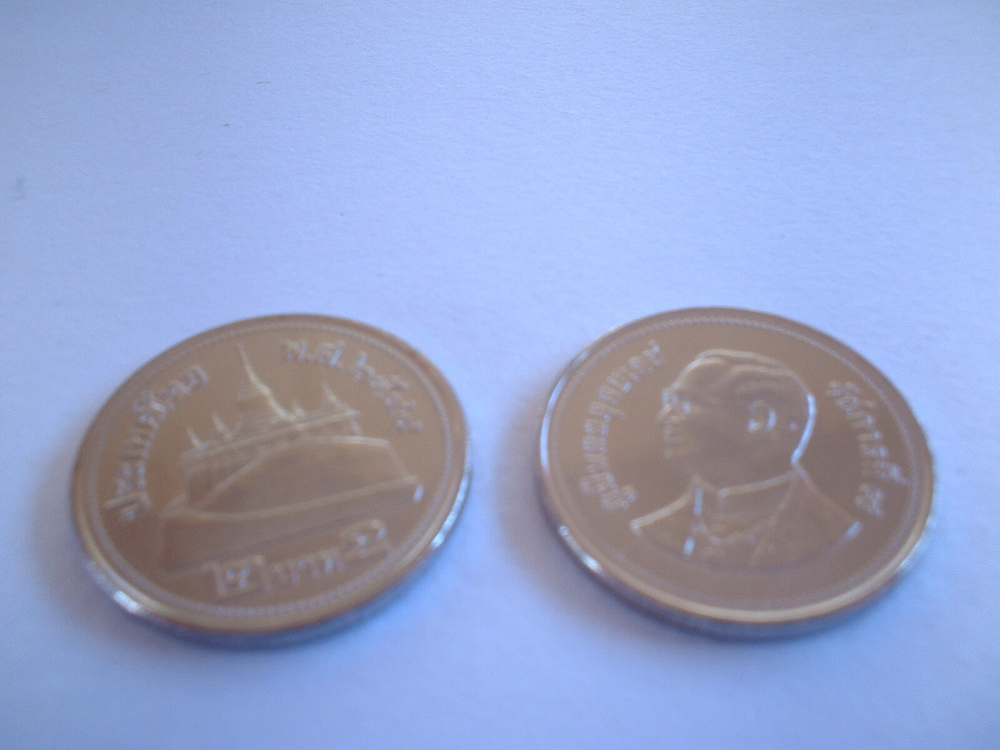

Gestern beim Aussortieren meines Klimpergeldes (die kleinen (1 und 5 Baht) in die Tempelbüchse) und die großen (10 Baht) zurück ins Portemonnaie) entdeckte ich zwei seltsame neue Münzen.

Die passten irgendwie nicht auf die normalen Stapel. Größer als 1 Baht und kleiner als 5 Baht. Und so glänzend neu.

Soso. Da haben wir also in Thailand die 2 Baht-Münze eingeführt. Ich musste ganz kurz überlegen, ob ich die nicht doch schonmal irgendwo gesehen habe. Ich bilde mir ein, dass dem so wäre. Eine Rückfrage bei meiner Bank-Thai ergab aber, dass sie noch nie 2 Baht-Münzen gesehen hat.

Also neu. Das ist fast so schlimm wie die Euro-Einführung vor zwei Jahren. Muss man ja immer kucken, was man rausgibt jetzt.

<!-- grammar-ignore UNPAIRED_BRACKETS ) -->
<!-- grammar-ignore FRAGEZEICHEN_STATT_PUNKT . -->
<!-- cspell:ignore Klimpergeldes -->
<!-- cspell:ignore Tempelbüchse -->
<!-- grammar-ignore RAN_RUM_RAUF_REIN_RAUS_RUNTER_NEU rausgibt -->
