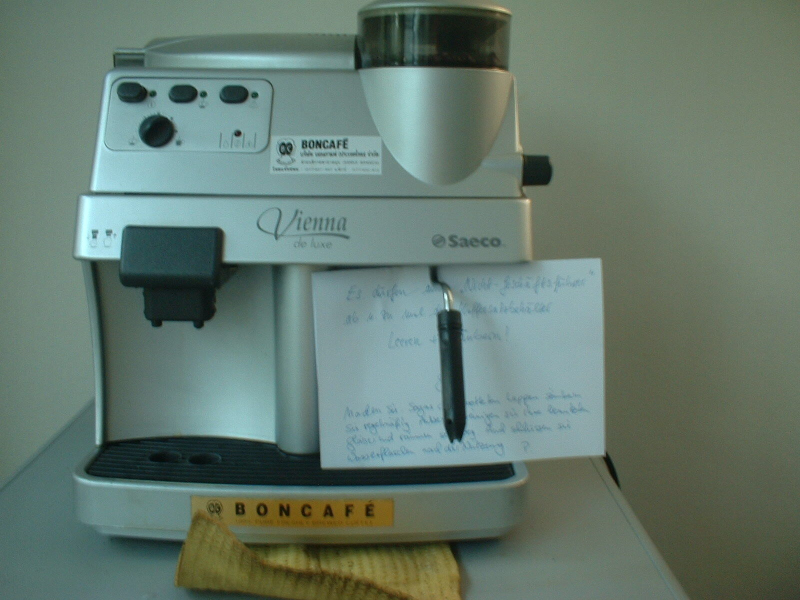

Es ist ganz praktisch, wenn man des Schreibens mächtig ist. Dann kann man die wirklich wichtigen Dinge des Lebens auch in einem 2-Mann-Unternehmen (Chef + Ich) auf Papier hinterlassen.

PS: Dies war ein Eintrag aus der Kategorie "Mein Chef und Ich". Freuen Sie sich auf mein im Herbst erscheinendes Buch "Mein Chef und Ich auf der Insel" mit Anekdoten aus dem täglichen Leben eines Programmierers mit eigenem Chef.
