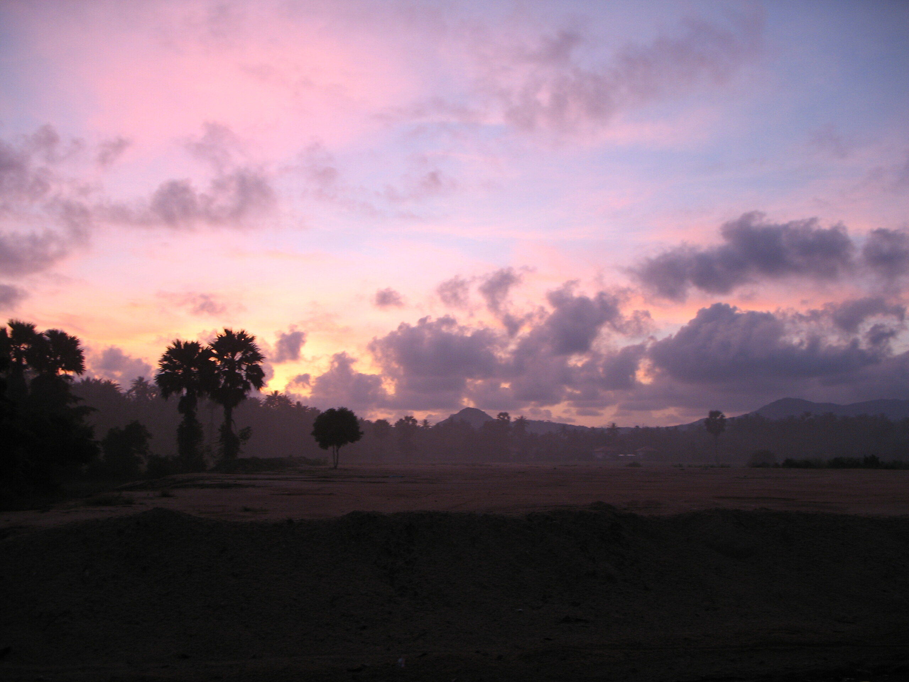

Morning in Ban Maenam (near my house)

Heute bin ich mal "etwas früher" auf Arbeit gefahren, weil ich eine bestimmte Sonnenaufgangsthese überprüfen wollte.

Hat alles geklappt (berichte später) bis auf die Tatsache, dass mein Vorderreifen wieder keine Luft hat. Das ist das 5. Mal in drei Monaten. Ab wie vielen Malen darf ich mich beschweren?

<!-- grammar-ignore AUF_ARBEIT auf Arbeit -->
<!-- cspell:ignore Morgenstund -->
<!-- cspell:ignore Sonnenaufgangsthese -->
