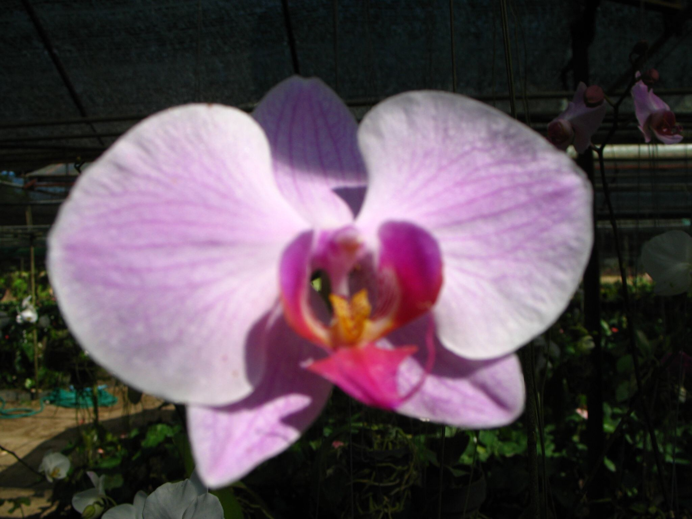

Orchid Garden in Donsak

Eigentlich ist der Orchid Garden nicht in Donsak, aber wo ist er dann, wenn er irgendwo im Nirgendwo versteckt ist? Wenn man aus Donsak heraus nach Surat Thani fährt (50 km geradeaus, geil), findet man auf der rechten Seite ein relativ unscheinbares Schild, folgt einer Strasse und ist da. Ruhe. Keine Touristen. Thai-Food. Blumenkram. Ganz nett. Und wer jede Menge Bilder von Blumen sehen will, sollte sich die ganze Photoserie vom Orchideengarten ansehen.

PS: Tipp an meine Mama. Ankucken.

