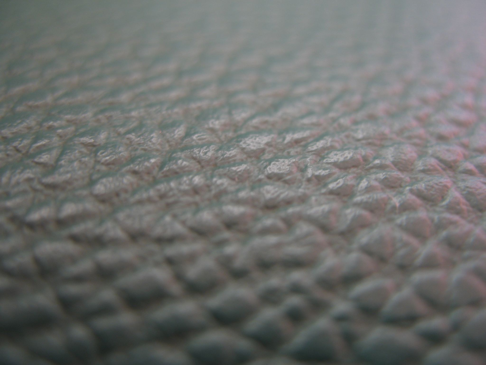
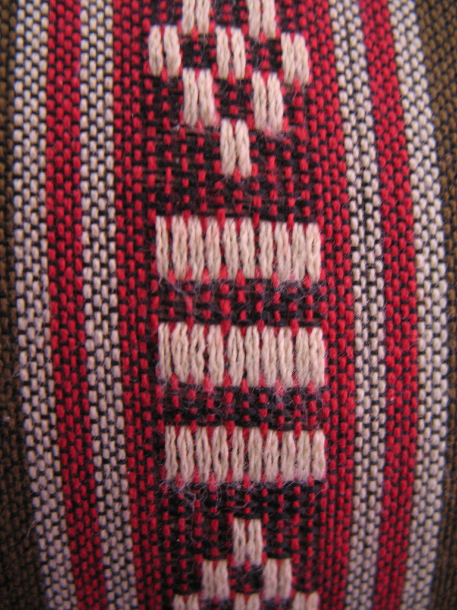
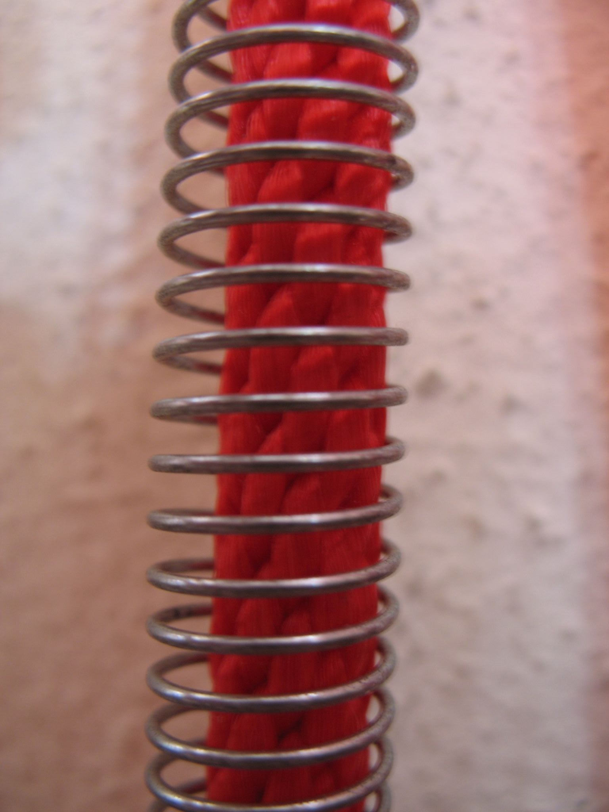
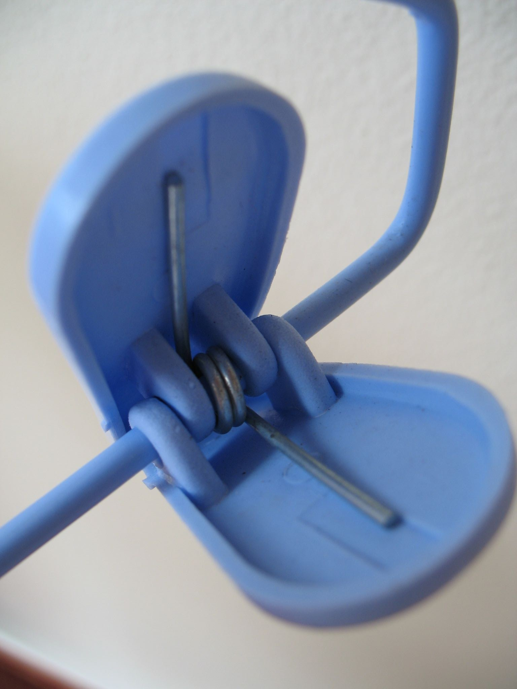
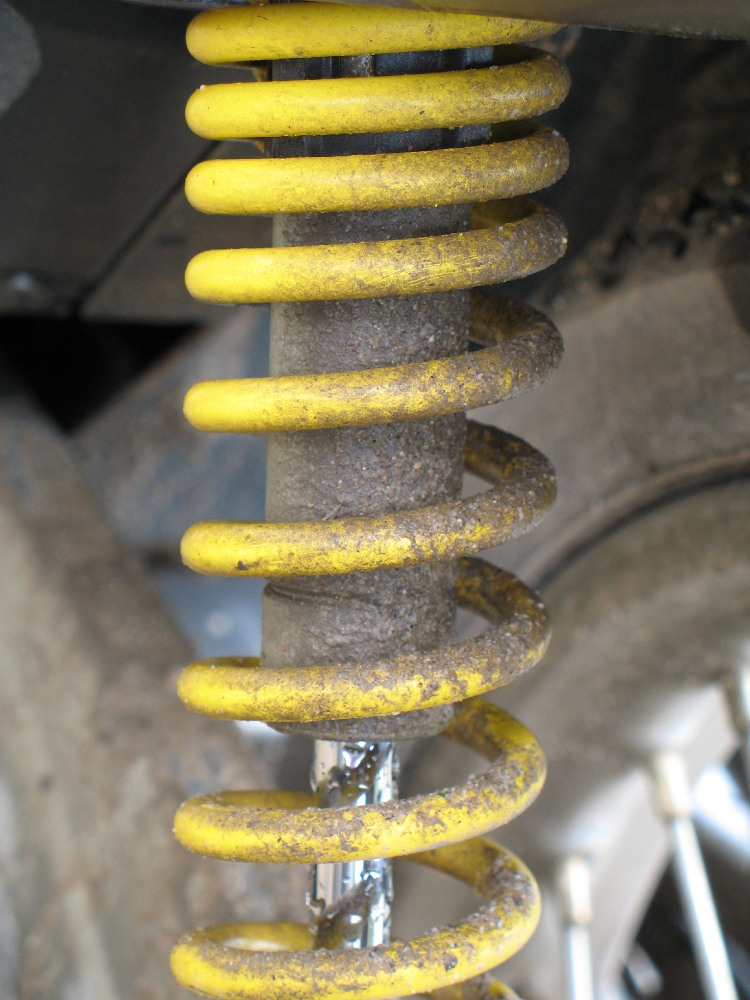

Ich bedauere ja Leute, die auf einsame kleine Inseln schwimmen, um ein verlängertes Wochenende zu verleben, das dann _so_ verregnet ist wie das Vergangene.

Jedenfalls hat die Regensaison 2006 begonnen :]

Grund genug für den vorbereiteten Farang stumpf in der Gegend herumzustarren und sich fürs nächste Mal mit genügend trink- und lesbarem Geistesgut einzudecken. Der Vorrat von der letzten Lektion war gerade verbraucht (Notiz an mich selbst: Murphy schlägt immer in murphyschen Momenten zu!)

Glücklicherweise gabs genügend Batterien und eine gewisse spielfreudige Kamera. Ergebnis? Na ja. Ich würde es mal experimentell nennen. [Hier][1], [hier][2], [hier][3] und [hier][4]. Und [hier][5]. Oder [hier][6] ("wobei das das Beste ist").

<figure id="photo-99560958">

</figure>

<figure id="photo-99560865">

</figure>

<figure id="photo-99560819">

</figure>

<figure id="photo-99560756">

</figure>

<figure id="photo-99560731">

</figure>

<figure id="photo-99560796">

</figure>

PS: Falls nochmal jemand fragt, warum die meisten Häuser hier auf "Stelzen" stehen: Damit man in der Regenzeit den Hund zum Gassigehen unters Haus fallen lassen kann.

 [1]: #photo-99560958
 [2]: #photo-99560865
 [3]: #photo-99560819
 [4]: #photo-99560756
 [5]: #photo-99560731
 [6]: #photo-99560796

<!-- grammar-ignore LEERZEICHEN_VOR_AUSRUFEZEICHEN_ETC begonnen : -->

<!-- grammar-ignore UNPAIRED_BRACKETS ] -->

<!-- grammar-ignore GERMAN_WORD_REPEAT_RULE das das -->
