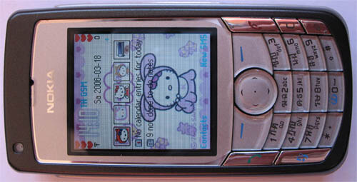

My new Nokia 6681

Unsereins hat ja jetzt auch ein neues Mobilfunktelefon. Mein altes, ein Siemens SL55 stand schon längere Zeit auf der Abschussliste, weil es mit den Temperaturverhältnissen hier nicht zurechtkam. Aller zwei drei Monate schaltete es sich wochenlang spontan bei Anrufen, SMSen und auch ohne jegliche Interaktion einfach aus. Seine Tage waren also gezählt. Mal ganz abgesehen davon, dass die Bastarde einfach ihre Mobilsparte an irgend ne japanische Firma verscheuert haben.

Als dann auch noch das Backupprogramm für die SMSse versagte und mir alle SMSse löschte und auf der Festplatte irgendwelche RTF-Dateien ohne Datums- und Senderangaben hinterließ (ich hatte noch Silvester-SMSse meines **Besten Freundes???** von 2004, dessen Geburtstag ich regelmäßig (auch dieses Jahr) vergessen habe) im Handy, sowas darf nicht einfach weg kommen) waren seine Tage ein für alle Mal gezählt.

Ich bin also zu Tesko gegangen und wollte ein Nokia (sic!) 3240 oder so. Mir schwebte Bluetooth und eine thailändische Tastatur vor. Heraus bin ich mit einem Nokia 6681 gekommen. Das hat nicht nur Bluetooth, Infrarot, nen MP3-Player mit weißen Kopfhörern und eine Thaitastatur, sondern auch noch ne Memorycard und ich kann "Doom" drauf spielen. Und hinten ist ne Klappe, wo, wenn man die Klappe runterschiebt, ein Photoapparat drunter ist. Absolutes High-Tech! Und rumblitzen kann man.

Und diesen ganzen Konnektivitätskram kann es auch. Ich hab schon per Mobile die schreiBBloga.de gelesen (ein Alptraum, da muss unbedingt was getan werden), Pornoseiten abgesurft (waren die Bildchen früher nicht weniger kB groß?) und E-Mails geschrieben.

Es kann nicht nur viel, es sieht auch ganz süß aus. Schwarz mit Chrom. Und der Screen ist größer als die Tastatur. Das gehört sich heute so. Die Benutzerführung ist etwas gewöhnungsbedürftig, aber man ist ja flexibel. Ich sag immer wer in Typo 3 ein Artikelerstellungsformular findet, der kommt auch mit Nokia-Mobiles zurecht.

Übrigens, Telefonieren kann man damit auch.

<!-- grammar-ignore N_NETTER_TYP ne -->
<!-- grammar-ignore DE_CASE Besten -->
<!-- grammar-ignore DOPPELTES_AUSRUFEZEICHEN ??? -->
<!-- grammar-ignore UPPERCASE_SENTENCE_START von -->
<!-- grammar-ignore UNPAIRED_BRACKETS ) -->
<!-- grammar-ignore DRAUF drauf -->
<!-- grammar-ignore DRUNTER drunter -->
<!-- grammar-ignore RAN_RUM_RAUF_REIN_RAUS_RUNTER_NEU runterschiebt -->
<!-- grammar-ignore RAN_RUM_RAUF_REIN_RAUS_RUNTER_NEU rumblitzen -->
<!-- grammar-ignore ERSTE_PERSON_SIN_OHNE_E sag -->
<!-- cspell:ignore abgesurft -->
<!-- cspell:ignore rumblitzen -->
<!-- cspell:ignore Konnektivitätskram -->
<!-- cspell:ignore Thaitastatur -->
<!-- cspell:ignore Memorycard -->
<!-- cspell:ignore Bloga -->
