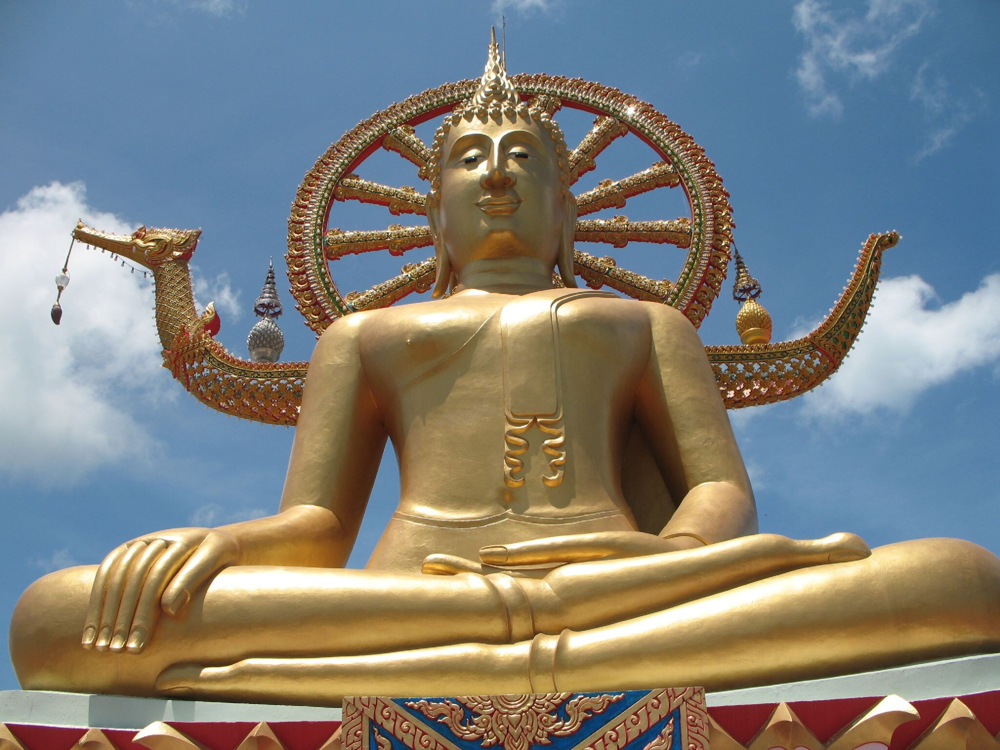

Wat Phra Yai (Big Buddha)

Dass Big Buddha jetzt ein Lebensrad und ein Schiff im Rücken hat berichtete ich ja schon häufiger. Am Anfang sah es noch so aus, als ob es nur eine temporäre Einrichtung für Loi Kratong sei, inzwischen ist es eine fest eingerichtete Sache. Da hat wohl jemand zu viel Geld gehabt. Abends blinkt das ganze dann. Ziemlich, ehm, sehenswert.

Jedenfalls gibts noch keine Postkarten mit dem neuen Motiv. Zwinker.

<!-- grammar-ignore SUBJUNKTION_KOMMA_2 Dass -->
