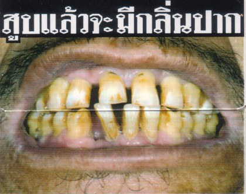

Bei flickr.com kann man jetzt das komplette [Set der Raucherbildchen][1] ansehen (diesmal mit fachgerechter Thenglisch-Übersetzung). Es gibt sechs verschiedene Motive, mit denen das Gesundheitsministerium Thailands den Leuten das Rauchen verleiden will. Die Bildchen sind größer als der Platz für die Zigarettenmarke. Das ist ganz nett. Allerdings laden sie doch eher zu lustigen Bemerkungen und Spielen ([die Zähne genau auf der Öffnung der Schachtel][2] lassen sich gut durch eine in den Schlitz gesteckte Zigarette verschönern) ein.

<figure id="photo-140712073">

</figure>

Da macht das Rauchen doch gleich doppelt soviel Spaß!!!

 [1]: https://web.archive.org/web/20070921055553/http://flickr.com:80/photos/schreibblogade/sets/72057594125955082/
 [2]: #photo-140712073

<!-- grammar-ignore DOPPELTES_AUSRUFEZEICHEN !!! -->
