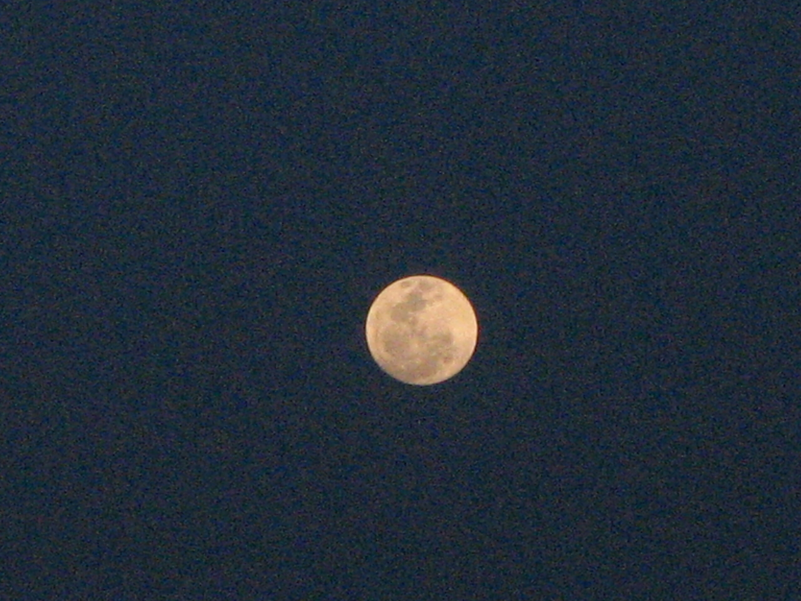

proof: there is a rabbit in the moon, no man

Hier ist der Beweis dafür, dass sich kein Mann im Mond befindet, sondern nur ein ordinärer kleiner Hase. Sagen die Thais und die haben recht, in Thailand. Was soll der Mann im Mond auch dort anstellen?

<!-- grammar-ignore UPPERCASE_SENTENCE_START proof -->
