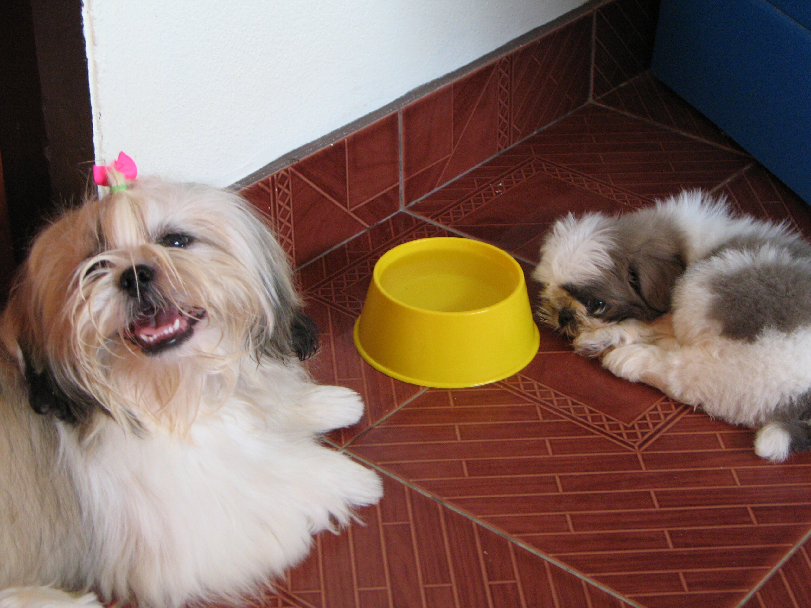

The long waiting

* Soosie hat die Tradition eingeführt, nahe dem Futter zu schlafen. Könnte ja außerplanmässig was kommen.
* Pokki spritzt 4 Palmen und einen Blumentopf auf seiner täglichen "Ich bin jetzt ein Mann"-Tour an und fällt beim Beinchen heben auch fast nicht mehr um.
* Soosie wiegt wieder 1100 Gramm, ist aber noch zu leicht für ihr Alter und darf zweimal am Tag fressen.
* Pokki bekommt weiterhin pinke Schleifchen mit Herzchen in den Zopf gebunden --- dafür beginnt sein Haar endlich zu wachsen, an manchen Tagen sieht er sogar ganz angenehm aus.
* Soosie pinkelt nachts erst und schreit dann, dass sie raus will. Es wurde daher ein Käfig angeschafft, den sie aufgrund einer Auffangschale gerne bepinkeln kann.
* Ins Haus hat sie seither nicht mehr gepinkelt.
* Mein Schlaf nachts wurde nach ausgiebigen Verhandlungen von 3,5 auf 4,5 Stunden erhöht. Länger hält die Kleine es nicht ohne Spielen aus. Pokki ist ziemlich genervt und beteiligt sich nicht am frühmorgendlichen Spiel.

<!-- grammar-ignore ZUSAMMENSCHREIBUNG_HER raus will -->
