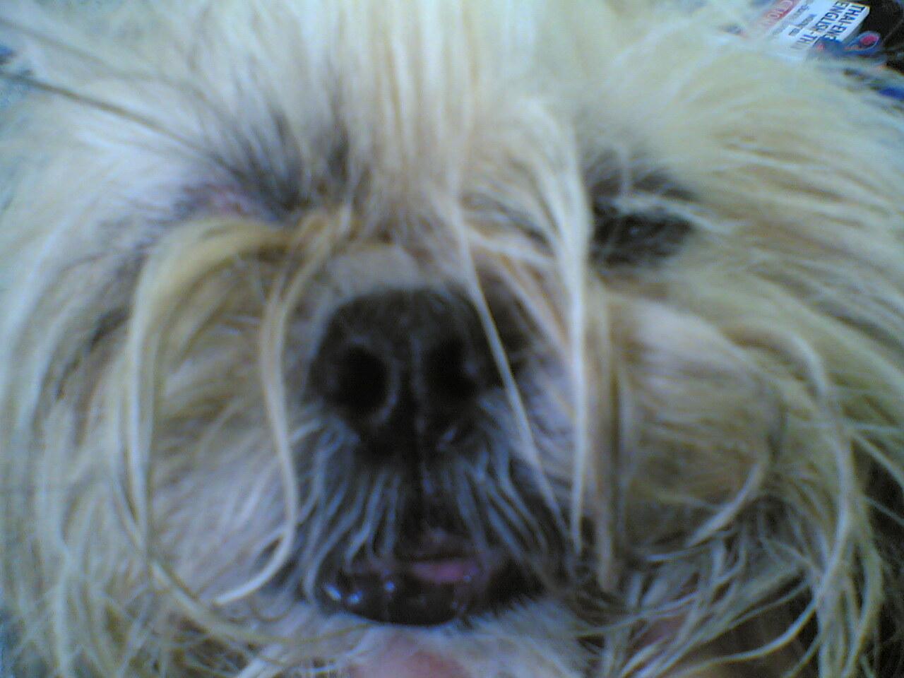

The brace

Gestern war Pokkis großer Tag. Wir fuhren morgens wieder ins Krankenhaus, er wurde eingehend begutachtet und wir wurden wieder weggeschickt. Ohne Pokki. Der Kleine musste dort bleiben und ich durfte ihn abends wieder abholen. Er war bis unter den Zopf mit Beruhigungsmitteln zugepumpt und begrüßte mich nur mit den Augen. Der Arzt hat ihm einen Kupferdraht um das Gebiss gewickelt. Jetzt sieht er aus wie ein Teenager mit Zahnspange und klingt auch so.

Er war so sehr zugedröhnt, dass er beim Gassigehen umgekippt ist, ohne mit dem Pinkeln aufzuhören. Das war nur beim Zukucken lustig. Jedenfalls geht es ihm wieder gut genug, dass er jeden Hund anbellt, der vorbeikommt. Mal sehen, ob er aus seiner Erfahrung gelernt hat. Reissuppe gibts jedenfalls noch für einige Zeit.

<!-- cspell:ignore Zukucken -->
