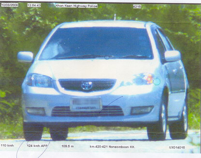

They have speed-traps now.

Im ländlichen Thailand sind vergangenen Monat die ersten stationären Blitzer aufgetaucht und sorgen für heftigste Diskussionen (größtenteils in der Art, dass man verwundert ist, dass so etwas möglich ist). In Bangkok dürfte es derartiges schon länger geben, zumindest 5 Rotlicht-Blitzer haben sie dort bereits. Weitere werden im kommenden Jahr errichtet.

Schwere Zeiten für Verkehrsteilnehmer.

