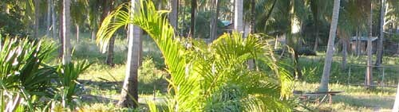

buffalos

"Neung wuan, then finish", sagte mir eben mein Landlord, als wir uns über die täglich durch den Vorgarten galoppierenden Büffel unterhielten. Letzten Mittwoch gab es wohl Verletzte, sodass am Donnerstag das Gebüffel verboten war. Ab Freitag dann liefen sie aber wieder vorbei am Haus. Ich habe so langsam aber sicher das Gefühl, dass es bei diesen Büffelkämpfen darum geht, welcher Büffel als erster die Absperrung durchbricht.

Für alle, die auf dem Bild wie ich auch nichts erkennen können: rechts von der im Weg stehenden Palme sieht man zwei Büffelrücken durch die Pampa rasen und links von der Palme die Staubspur, die sie hinterlassen.

Irgendwas müssen sie an der Kampfarena geändert haben, denn die Tage nach vergangenem Mittwoch liefen sie nur noch rechts am Haus in der Entfernung wie im Photo vorbei. Allerdings ist 50 Meter weiter auch schon die Ringroad.

<!-- grammar-ignore UPPERCASE_SENTENCE_START buffalos -->
<!-- cspell:ignore Gebüffel -->
<!-- cspell:ignore wuan -->
