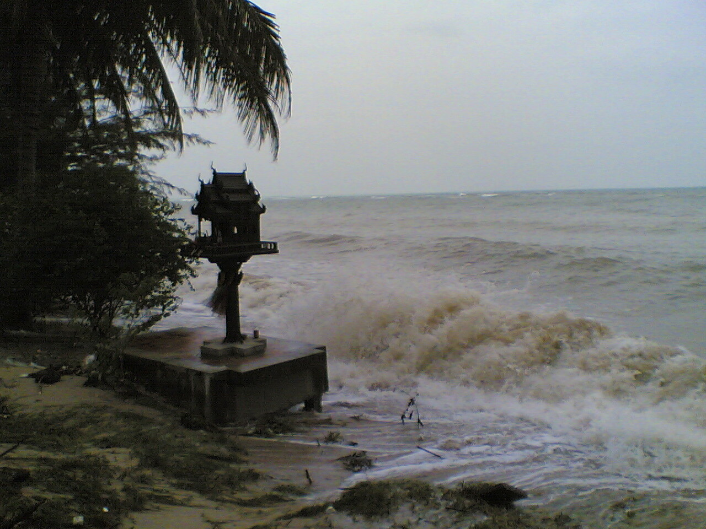

Ghosthouse in Bang Por

Ich habe vorhin schnell nochmal mein Lieblingsgeisterhaus photographiert, ehe es von den Wellen weggeschwemmt wird. Interessanterweise ist es im Norden der Insel (Bang Por, Ban Thai, Maenam) stürmischer als im Westen (Nathon), wovon [überfluteten Straßen][1] die Rede ist. Es sind eher Wellen die gegen die Mauer der Strandstraße in Nathon schlagen und dann die Straße etwas nass machen.

Ein paar Männer, die am Pier aufräumten, erzählten mir gelassen, dass das Wetter gut zum Müll wegsammeln ist, weil das Wasser den ganzen Dreck und Schrott an den Strand spült.

Die Fähre fuhr auch, nur die Fischerboote blieben lieber im Hafen. Wobei auch das wieder relativ ist, denn entlang der Straße haben sie (gegen 12 Uhr) die Netze geflickt, was bedeutet, dass sie bereits wieder heim gekommen sind.

Aber, um zu meinem Lieblingsgeisterhaus zurückzukommen (warum es mein Lieblingsgeisterhaus ist? Es ist aus schwarzem oder sehr dunklem Holz gebaut, ich habe es noch nie geschafft, ein Photo zu schiessen, auf dem man das Haus erkennt.) --- es sieht so aus, als ob es bei weiterem Wellengang nicht mehr stehen bleiben wird. Normalerweise ist es vom Sand fest verpackt. Dass es auf Stielen steht, habe ich noch nie gesehen.

 [1]: https://web.archive.org/web/20070224032419/http://www.nationmultimedia.com/2006/12/22/national/national_30022242.php
