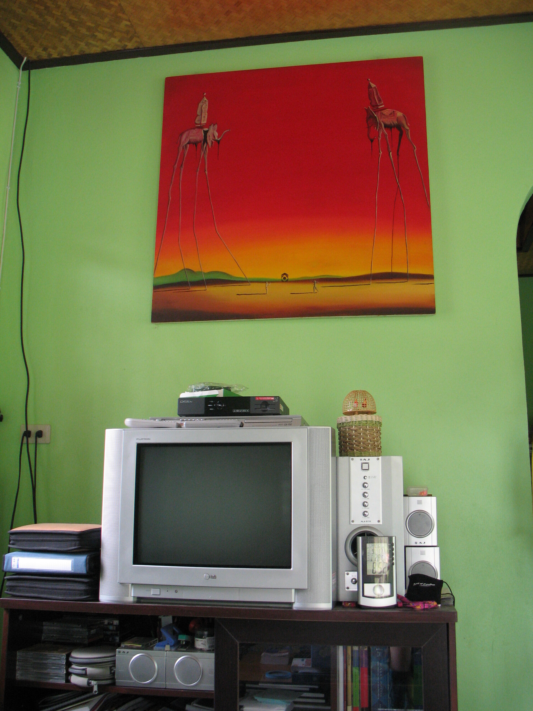

my cheap dali-copy

Mein Bild hab ich mir zu Weihnachten 2005 geschenkt. Für normale Touristen kostet so eine billige Dali-Kopie 7000 Baht, ich hab Fu vorgeschickt und es für 1500 Baht und 500 Baht für den Rahmen (irgendwie mussten sie dann noch Geld herausschlagen) bekommen. Dann fing es an zu regnen und ich bin mit dem Moped im Regen heim gefahren und Fu mit dem Bild im Taxi.

Dann stand das Bild 7 Monate verpackt in der Gegend rum. Dann bin ich umgezogen und die neuen Hausbesitzer erlaubten mir "ein" Bild aufzuhängen.

Ein langer Weg für _Mein Bild_&trade;. Aber es hängt nun und ich habe es genau im Blickfeld den ganzen Tag. Sehr schön. Irgendwie habe ich schon jeden Quadratzentimeter einmal photographiert.

Man beachte wie gut sich die Farben des Hauses mit dem Bild ergänzen. Ich mag mein Bild.

<!-- grammar-ignore UPPERCASE_SENTENCE_START my -->
<!-- cspell:ignore dali -->
<!-- grammar-ignore RAN_RUM_RAUF_REIN_RAUS_RUNTER rum -->
<!-- grammar-ignore GERMAN_WORD_REPEAT_BEGINNING_RULE Dann -->
