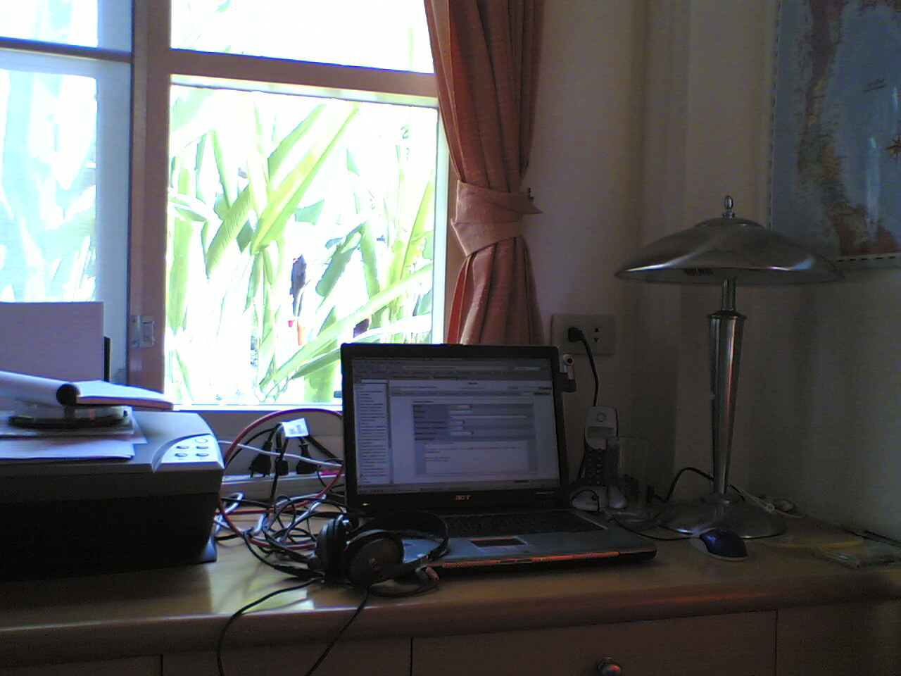

Senior Service Supervisor

Ich habe schon einen Benutzer unter einem Exchange-Server eingerichtet, Rechte für einen Ordner vergeben, jede Menge Kram gebackuppt und einen Barcodefont installiert. Alles ein click-and-point-Spiel. Für _Den Kunden_&trade; aber sieht es so aus, als ob ich ein Halbgott mit goldenen Notebooktasten bin.

Jaja … Windows …

<!-- grammar-ignore DE_CASE Den -->
<!-- cspell:ignore gebackuppt -->
