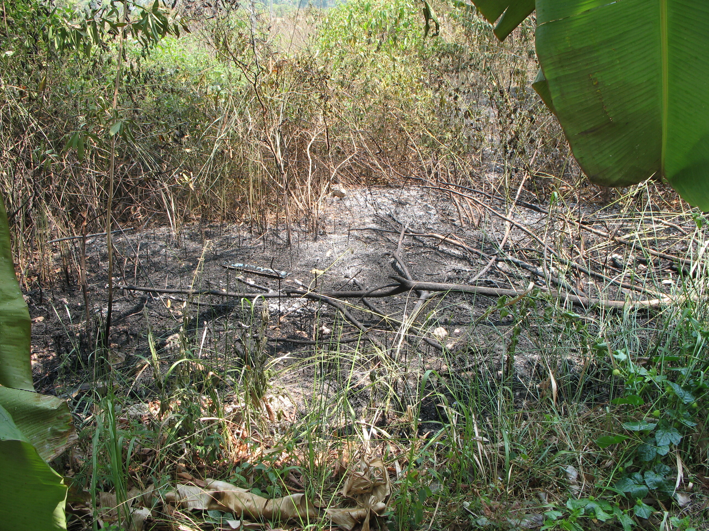

After the fire

Die großen Ereignisse finden immer ohne mich statt. Eben kam ich aus dem Tesko zurück und die Büsche hinterm Haus brennen lichterloh. Die Straße 5 Meter weiter ist voller Aschefussel, es qualmt und knackt.

Am Haus angekommen jaulen die Hunde vor sich hin, weil alle Fenster offen sind --- 33 Grad, ein bisschen Lüftung muss ja sein. Dummerweise war die Lüftung in diesem Fall Qualm. Also liess ich sie schnell raus und sie gingen, sich das Feuer aus der Nähe zu betrachten.

Mein Hausherr war auch schon in Aktion und löschte mit dem Gartenschlauch (und meinem Wasser. Was für ein Glück, dass das gratis ist). Er war ziemlich wütend, sofern man sein Stirnrunzeln so deuten kann. Gefühle artikuliert er lieber subtil.

Wir haben da zwei Thesen. Die erste ist die von einem Thai, der seinen Müll verbrannte, was ausser Kontrolle geriet. Das ist aber eher unwahrscheinlich, weil hier alle am Abend ihren Kram verbrennen. Die andere These ist schon wahrscheinlicher: Große Trockenheit seit Wochen, Hitze und eine achtlos weg geworfene Chipstüte dürften ausreichen, um das Stroh zum Brennen zu bekommen.

<!-- cspell:ignore Aschefussel -->
