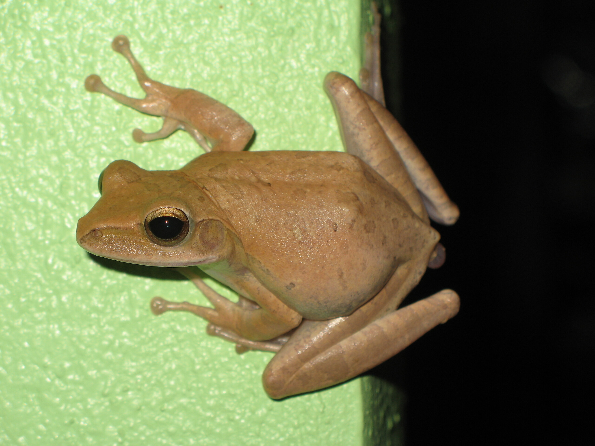

Karl

Karl lebt in meinem Haus. Ich habe versucht, ihn raus zu schmeissen, aber wie das mit den Karls dieser Welt so ist, jedes Mal war er nach ein paar Stunden wieder da. Tagsüber sitzt er in einer oberen Ecke in der Küche oder im Wohnzimmer und harrt der Dinge, die da kommen mögen.

Nachts kommt er raus und frisst den Hunden die Leckerlis weg und springt in der Gegend rum. Ich stehe schon gar nicht mehr auf, wenn Nachts irgendwas im Wohnzimmer durch die Gegend fliegt, weil es meist nur der Frosch war, der irgendwas durch Sprunggewalt beiseite stieß.

<!-- grammar-ignore RAN_RUM_RAUF_REIN_RAUS_RUNTER rum -->
