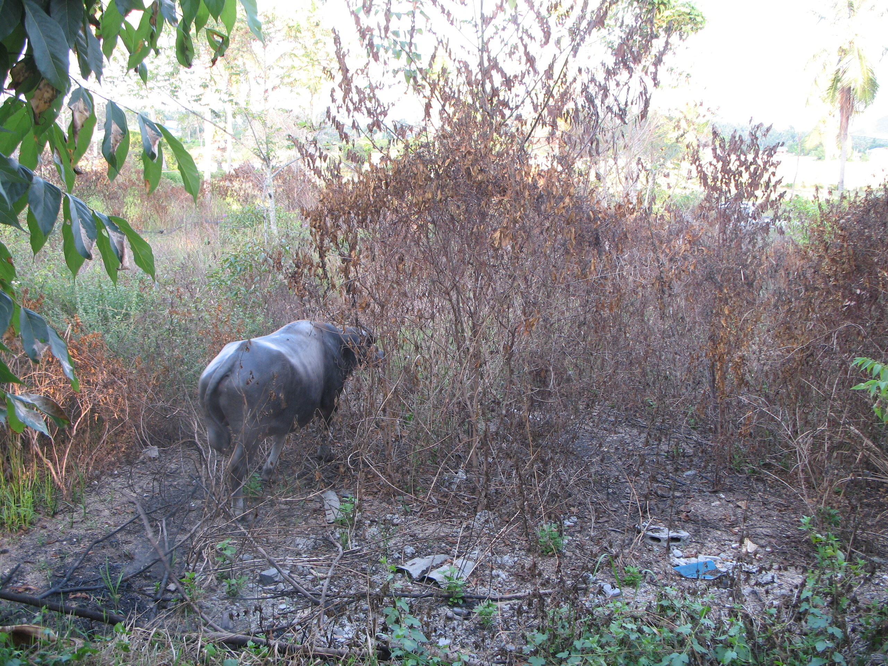

After the fight

Als gestern Vormittag ein Marktschreier-Pickup den Feldweg entlang kam, dachte ich mir schon, dass es wieder so weit wäre. 50 Meter vor meinem Haus schalteten sie das Band, das bis dahin auf Thai vor sich hin schrie, quietschend und rückkoppelnd aus und ein alter Mann begann auf Thanglish (ein Service nur für mich, denn niemand sonst in meiner Ecke hier versteht kein Thai) zu verkünden:

Baffallowfaitingg! Buffalowfaitingg! The champ of thee champions (_das haben Sie von den Thai-Boxern geklaut_). Come to see Buffallow! Fighting! One Million Baht Money! Buffalow!!!

50 Meter weit weg schalteten sie wieder das Thaiband auf. Ich war gewarnt.

Die ganze Zeremonie hatten wir ja im vergangenen Jahr schon. Erst hört man freudiges Schreien, dann hört man panisches Schreien, dann hört man hämmernde Hufen, dann sieht man einen dunklen Rücken durch den Dschungel galoppieren, dann kommen die jagenden Mopeds, dann die fliehenden Zuschauer. Das läuft jedes Mal nach dem gleichen Schema ab.

Heute nun kam der Protagonist des Kampfes direkt am Haus vorbei, schnaufte kurz die Hunde an, die erregt vor sich hin kläfften und bahnte sich dann hinter dem Haus einen Weg in den (abgebrannten) Dschungel, nur um 10 Meter weiter wieder herauszukommen. Jetzt gerade laufen sie auf der Straße 50 Meter weiter hinter ihm her.

Buffalow-Fighting. Großartig.

<!-- grammar-ignore DOPPELTES_AUSRUFEZEICHEN !!! -->
<!-- cspell:ignore Baffallowfaitingg -->
<!-- cspell:ignore Buffallow -->
<!-- cspell:ignore Buffalow -->
<!-- cspell:ignore Buffalowfaitingg -->
<!-- cspell:ignore Thaiband -->
