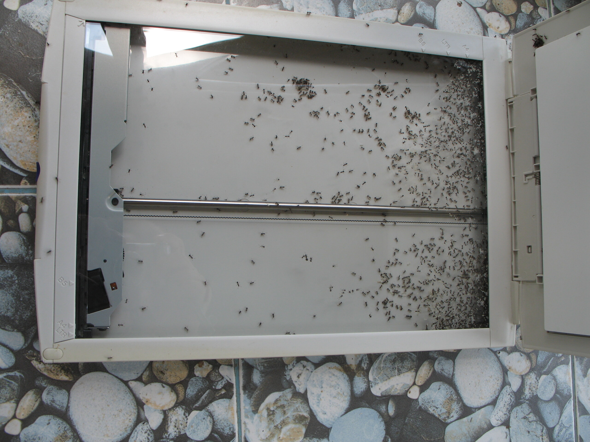

Ants. Again.

Das Leben im Dschungel bringt manchmal weniger nette Überraschungen mit sich. Wie beispielsweise das Ameisennest im Scanner.

Hab ihn kurz in die Sonne gestellt und die Ameisen zum Verlassen aufgefordert. Einige sind schnell verschwunden, der Großteil ist aber erstickt oder verbrannt oder was auch immer. Das ist mir aber inzwischen egal. Ameisen müssen nicht in meinem Haus leben.

Neulich waren sie noch in der Tripod-Tasche.
