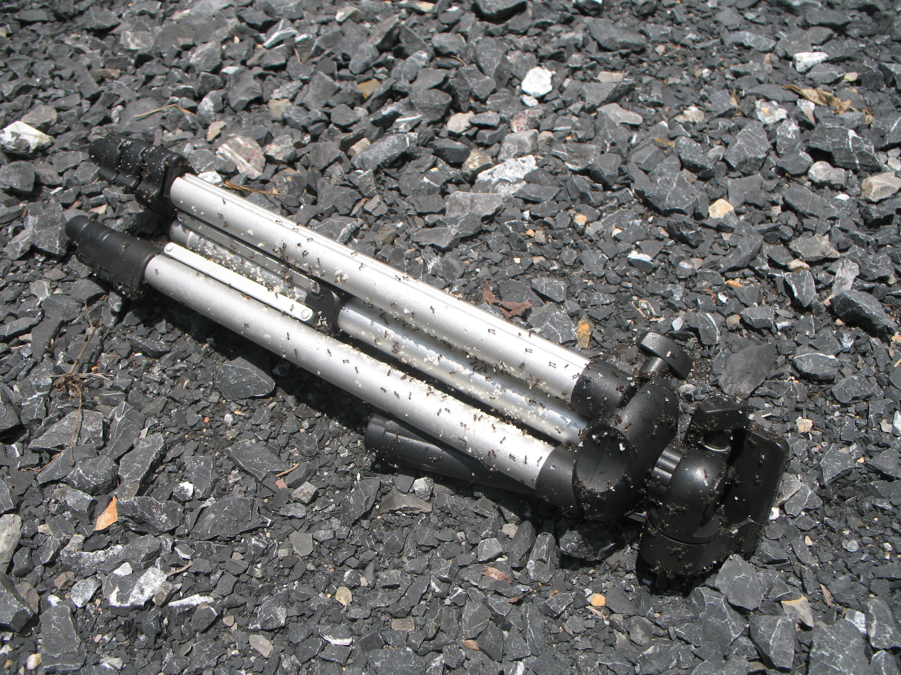

Technical Problems

Das Leben im Dschungel bringt manchmal weniger nette Überraschungen mit sich. Wie beispielsweise das Ameisennest in der Tripod-Tasche. Jetzt gibt es viele ersoffene Ameisen, hunderte heimatlose Ameisen und eine vernichtete zukünftige Generation.

Neulich habe ich sie schon aus meiner CD-Sammlung verjagt. Eier zwischen CD-Rohlingen ist entscheidendes Kriterium um selbige (die Rohlinge) unbrauchbar zu machen. Mal sehen, wo sie beim nächsten Mal landen.
