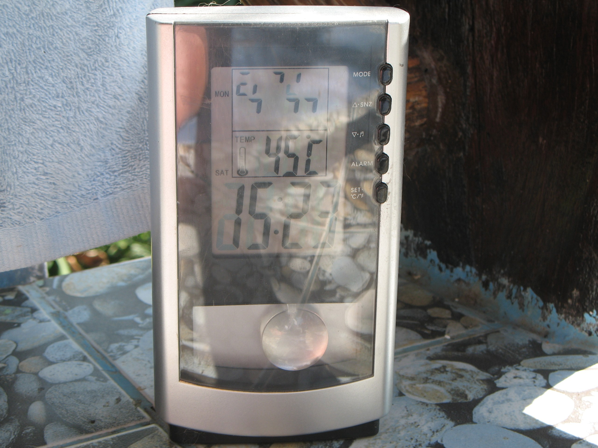

Es ist mal wieder Zeit die Tabs aufzuräumen, die es nicht in eigene kleine Einträge geschafft haben.

* Hin und wieder gibt es ja Gerüchte, man wolle die Amtszeit von General Sonthi Boonyaratglin, unter anderem Putschführer, verlängern, damit er Thailand bis zur nächsten Wahl "begleiten" kann. Premierminister Surayudh hat das nun ausgeschlossen[^src-nation-30032410]. Schade. Ein Gerücht zu Sonthis Zukunft weniger. Wenn er allerdings kein Armeeführer ist, könnte er dann nicht eventuell, vielleicht, er hat ja Zeit, man weiß ja noch gar nicht, wer der nächste Premierminister werden wird …
* Sternchen auf der Zahnbürste[^src-nation-30032384]: wenn Zahnbürsten nun Sternchen haben, sind sie gut genug für thailändische Münder. Ich selbst bin ja vivider Nutzer von [Colgates 360degree-Bürste][3] (eine Schande, dass ich für diese Zeile kein Geld bekomme) --- seit langer Zeit mal eine Bürste ohne den Tomatenkratz-Biegeknubbel hinter dem Griff. Der Rubbel-Belag für die Zunge bringt mich regelmäßig zum Würgen … Was man nicht alles tut für die Beißerchen …
* Thaksin, für die weniger regelmässigen meiner Leser: der war mal Premierminister, hat Interesse an einem Fussballclub[^src-nation-30032435]. Wieder in England (Liverpool, Fulham und die Wolverhampton Wanderers waren schon auf seiner Liste) sei nun Manchester City sein Begehr. Mal sehen, ob er Glück hat. Sein Töchterchen lebt ja schon in London und ist total "down to earth", sagen ihre Freunde. Sie lädt sie sogar nach Hause ein und [lässt ihre Bediensteten für sie kochen][5].
* [Die ersten Kritiken][6] am Entwurf der neuen Verfassung Thailands[^src-nation-30032486] tauchen auf: Sie sei zu sehr darauf zugeschnitzt, Zeiten wie die Thaksin-Ära zu verhindern und achtet weniger auf die eigentlichen Probleme oder ist zu ungenau an bestimmten Stellen. Na ja. Ist ja nur ein Entwurf.
* Der Chef vom DSI, dem Inlandsgeheimdienst, wurde versetzt[^src-nation-30032494], weil er angeblich zu unentschlossen war, bestimmte Fälle aus der Thaksinzeit aufzuarbeiten. Er war wohl zu bekannt mit bestimmten Leuten …
* Das Wetter: [warm][9] …

<figure id="photo-471083867">

</figure>

 [3]: https://web.archive.org/web/20081119045251/http://www.colgate.com./app/Colgate360/US/HomePage.cvsp

 [5]: http://www.thestandard.com.hk/news_detail.asp?pp_cat=21&art_id=42544&sid=13201606&con_type=1
 [6]: https://web.archive.org/web/20081013061514/http://www.nationmultimedia.com/2007/04/23/headlines/headlines_30032456.php

 [9]: #photo-471083867

<!-- grammar-ignore DE_REPEATEDWORDS_NUN nun -->

<!-- cspell:ignore Roon -->

[^src-nation-30032435]: Historische Quelle: `http://nationmultimedia.com/2007/04/23/politics/politics_30032435.php`. Bei der Prüfung am 10. Oktober 2026 konnte keine Verbindung zum Anbieter hergestellt werden. Die Abfrage beim Internet Archive lieferte keinen archivierten Treffer für diese Adresse. Die ursprüngliche Adresse bleibt zur späteren Recherche erhalten.

[^src-nation-30032384]: Historische Quelle: `http://www.nationmultimedia.com/2007/04/22/national/national_30032384.php`. Bei der Prüfung am 10. Oktober 2026 konnte keine Verbindung zum Anbieter hergestellt werden. Die Abfrage beim Internet Archive lieferte keinen archivierten Treffer für diese Adresse. Die ursprüngliche Adresse bleibt zur späteren Recherche erhalten.

[^src-nation-30032486]: Historische Quelle: `http://www.nationmultimedia.com/2007/04/23/headlines/headlines_30032486.php`. Bei der Prüfung am 10. Oktober 2026 konnte keine Verbindung zum Anbieter hergestellt werden. Die Abfrage beim Internet Archive lieferte keinen archivierten Treffer für diese Adresse. Die ursprüngliche Adresse bleibt zur späteren Recherche erhalten.

[^src-nation-30032410]: Historische Quelle: `http://www.nationmultimedia.com/breakingnews/read.php?newsid=30032410`. Bei der Prüfung am 10. Oktober 2026 konnte keine Verbindung zum Anbieter hergestellt werden. Die Abfrage beim Internet Archive lieferte keinen archivierten Treffer für diese Adresse. Die ursprüngliche Adresse bleibt zur späteren Recherche erhalten.

[^src-nation-30032494]: Historische Quelle: `http://www.nationmultimedia.com/breakingnews/read.php?newsid=30032494`. Bei der Prüfung am 10. Oktober 2026 konnte keine Verbindung zum Anbieter hergestellt werden. Die Abfrage beim Internet Archive lieferte keinen archivierten Treffer für diese Adresse. Die ursprüngliche Adresse bleibt zur späteren Recherche erhalten.
