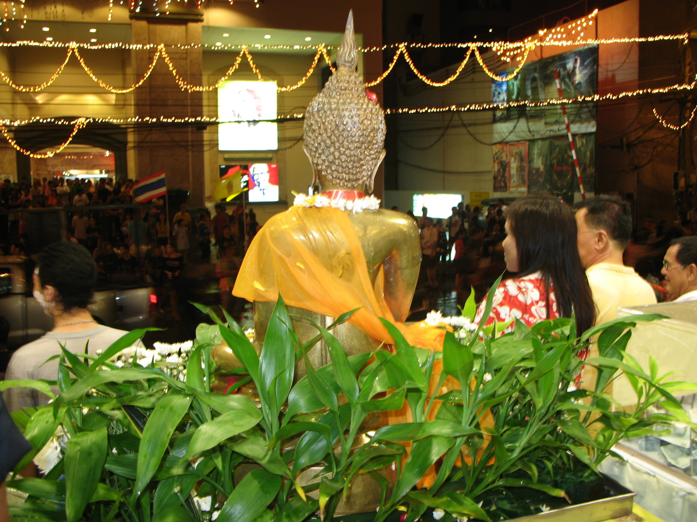
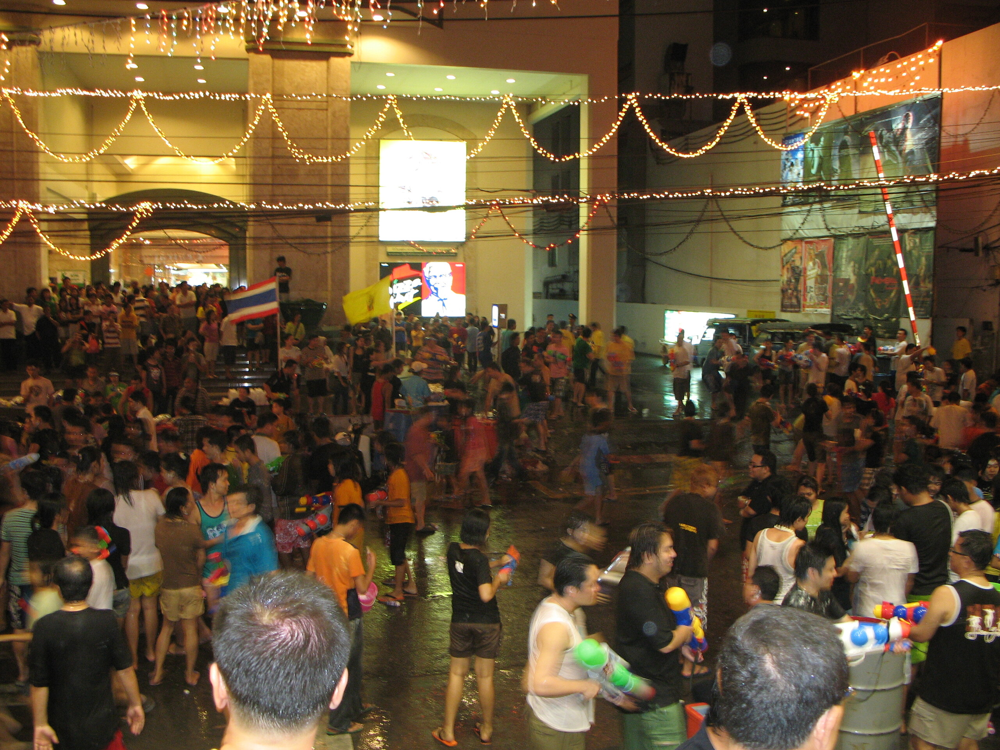

Wir befinden uns mitten im Songkran, dem thailändischen Jahreswechsel. Das offizielle Neujahr in Thailand ist seit 1941 der gleiche Tag, der im gregorianischen Kalender das Neujahr darstellt, der 1. Januar. Das ist nicht der richtige Gregorianische Jahresanfang, sondern der Jahresanfang des Suriyakati-Kalenders, den man auch als gregorianischen Kalender Thailands bezeichnet. Gezählt wird allerdings vom Todestag Gautama Buddhas, 543 v. Chr. an, so dass wir nun das Jahr 2550 haben.

Songkran ist der Zeitpunkt, an dem die Sonne in das Tierkreiszeichen des Widders, im indischen Tierkreis Mesha-Rasi, eintritt. Songkran ist wie viele andere Begriffe aus dem Sanskrit entlehnt und bedeutet soviel wie "Bewegen" oder "Wechseln", also der Wechsel der Sonne in einen neuen Tierkreis.

Das genaue Datum des "großen Songkrantages", des Tages, an dem die Sonne wechselt, wird von den königlichen Astrologen berechnet. Dieses Jahr fällt er auf heute, Samstag, 14. April. Das ist leider kein gutes Zeichen, denn fällt der große Songkrantag auf einen Samstag, muss man mit Missernten, Konflikten und teuren Gütern rechnen. Die [offizielle Bekanntgabe des großen Songkrantages][1] findet in Zeiten des Internets auf einer (nicht zensierten) Webseite statt.

Songkran besteht theoretisch aus den drei Tagen zwischen dem 13. und 15. April. Vielerorts fängt man aber schon ein paar Tage eher mit dem Feiern an (siehe [Photos von meiner Nacht in Hat Yai][2]) und zieht die Feiern bis zum 17. April hin.

Bereits am Vorabend des ersten Songkrantages ist Frühjahrsputz angesagt. Man will nicht mit dem Schmutz des alten Jahres in das neue Jahr gehen. Am 13. April feiert man Wuan Mahasongkran, den letzten Tag des Jahres. Man geht ins Kloster und opfert den Mönchen Reis (mehr als sonst), Süsskram und andere Sachen. Der Abt und die Buddhafiguren des Klosters werden nachmittags rituell gereinigt, indem man sie mit Wasser übergießt. Auch die älteren Familienmitglieder werden derart geehrt. Der 13. April ist gleichzeitig der [National Elderly Day][4]. Am 14. April ist Wuan Nao, der Tag zwischen den Jahren oder "Der Tag nach dem Ende des letzten Tages". Am 15. April, Wuan Talueng Sok, feiert man den eigentlichen Neujahrstag.

Eine andere Tradition ist, am großen Songkrantag neun Tempel zu besuchen, was ich dieses Jahr aus technischen Gründen unterlassen habe.

Dass die "traditionellen Wasserschlachten" eine leichte Übertreibung der Tradition ist, Wasser über die Hände der Älteren und der Mönche zu gießen, macht den Kämpfern allerdings keine Sorge.

Weshalb Songkran außerhalb Thailands als "das Wasserfestival" bekannt ist. In eher traditionell orientierten Familien ist es [ein Fest, an dem man die Eltern und Großeltern ehrt][6]. Man braucht sich also nicht wundern, wenn rund um Songkran die Zeitungen voll mit Berichten über geriatrische Fakten wie bspw. der Tatsache, dass [jeder 5. ältere Thai allein lebt][7] (ein Zeichen für den Verfall der Familienwerte). In Bangkok dürfen an den drei Songkrantagen alle Thais über 60 Jahre gratis mit dem Skytrain fahren.

 [1]: https://web.archive.org/web/20070416115358/http://www.songkran.net/en/announce.php
 [2]: http://flickr.com/photos/schreibblogade/tags/songkran2007/
 [4]: https://web.archive.org/web/20081015215909/http://nationmultimedia.com/2007/04/12/national/national_30031723.php
 [6]: https://web.archive.org/web/20070714093348/http://www.nationmultimedia.com/2007/04/13/opinion/opinion_30031802.php
 [7]: https://web.archive.org/web/20070713161158/http://www.nationmultimedia.com/2007/04/13/national/national_30031813.php

<!-- grammar-ignore DE_DATE_WEEKDAY_CURRENTYEAR Samstag, 14 -->
