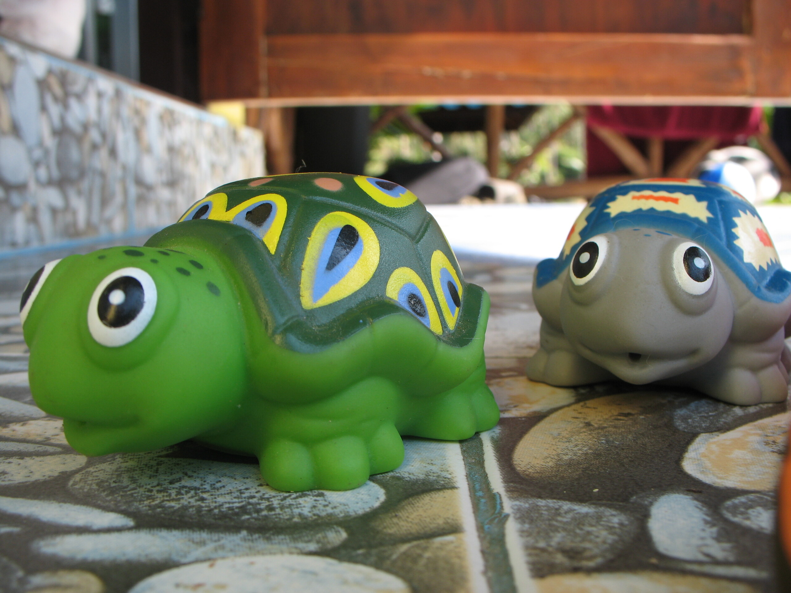

Turtles

Hier vertreten durch die Glubschäugige Hundehaus-Schildkröte, Cryptodira Testudinoidae Geoemydidae Plastica, die so nur noch in begrenzten Lebensräumen auf Samui im Dschungeldickicht von Ban Thai zu finden ist.

<!-- cspell:ignore Cryptodira -->
<!-- cspell:ignore Geoemydidae -->
<!-- cspell:ignore Testudinoidae -->
<!-- cspell:ignore Plastica -->
<!-- cspell:ignore Glubschäugige -->
