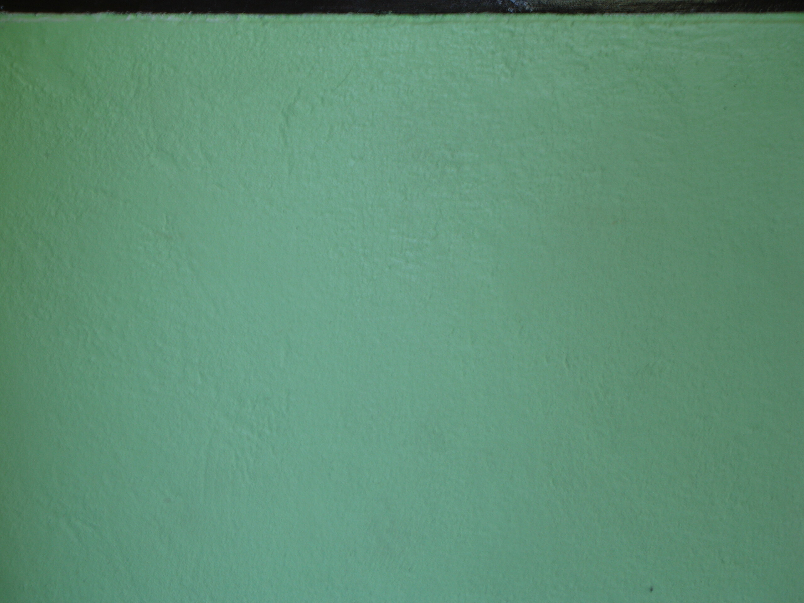

After the water

Kleine Wunder geschehen hin und wieder und so testete ich heute mal, ob nach drei Tagen in einer luftdichten Küchendose gefüllt mit Reis meine kleinen Techtoys wieder funktionieren. Und siehe da: Die Kamera geht wohl wieder. Die Linse ist etwas schmutzig und hin und wieder bekommt die Elektronik den Focus nicht hin und weigert sich, das Photo zu schiessen.

Das Mobile bleibt tot. Kurzschluss. Sobald die Batterie eingelegt wird, blitzt der Blitz. Dauerhaft. Das ist eine heisse leuchtende Sache. Der Vorteil ist allerdings, dass ich nun endlich eine Notfall-Lampe im Haus habe.

Den von Ameisen bevölkerten Scanner habe ich übrigens auch wieder zum Funktionieren gebracht. Das war aber etwas komplizierter. Das Ding ist ja nur geklebt. Das muss man sich mal vorstellen. Ich weiß gar nicht, warum die paar zusammengesteckten und -geklebten Teile damals so viel gekostet haben …

Jedenfalls wurde das Teil auseinandergenommen, den Ameisen eine würdige Dschungelbestattung geboten, ein bisschen geputzt und weiter scannt er.

Nächste Woche eröffne ich meinen kleinen Techtoy-Repair-Shop

<!-- cspell:ignore Techtoy -->
<!-- cspell:ignore Techtoys -->
<!-- grammar-ignore GERMAN_WORD_REPEAT_BEGINNING_RULE Das -->
