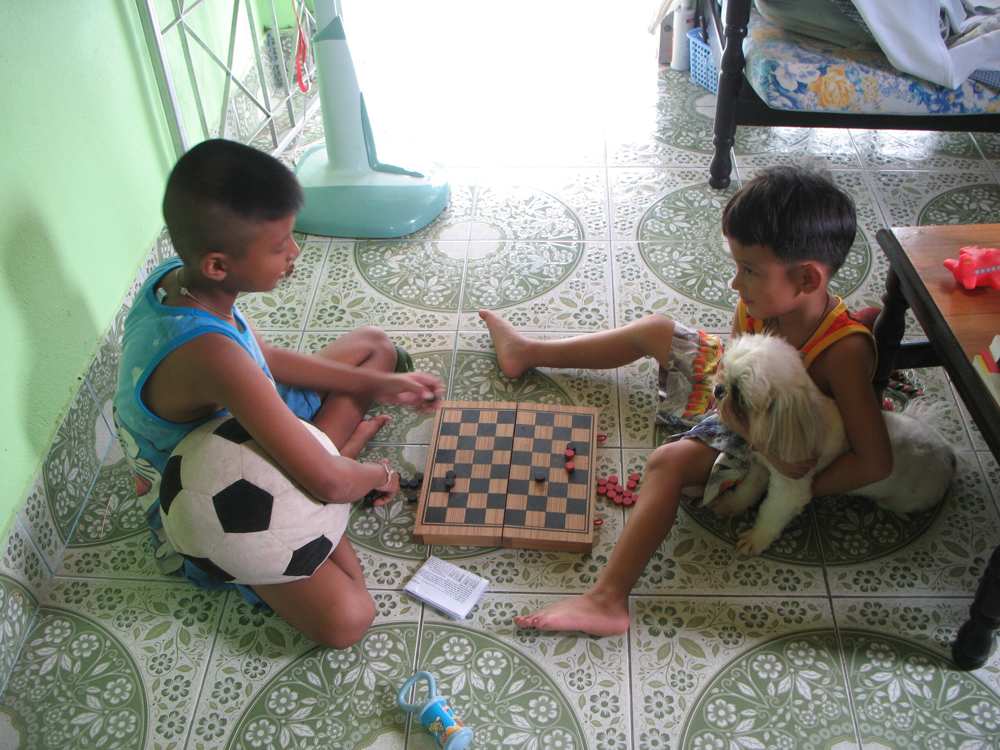

Chess. Kind of …

Das sind Damn und Khaw (schwarz und weiß), die Kinder meiner Hausherren beim Spielen. In meinem Haus. Sie kommen immer mal vorbei und bringen alles durcheinander.

Der Kleine mag Soosie ganz sehr und trägt sie wie eine Handtasche mit sich rum. Das mag sie sogar, also kann ich das zulassen. Pokki mag ihn nicht und knurrt ihn ganz, ganz böse an. Ich gehe davon aus, dass es da im Januar "Vorkommnisse" gab.

Heute kamen die beiden und fütterten Pokki und Soosie mit allen (ALLEN) Leckereien, die die beiden normalerweise bekommen, wenn sie mal gehorchen. Also eher selten. Gibts halt kein normales Futter heute.

Dann spielten sie Schach. Oder sowas wie Schach. Dabei wurde viel geredet, die Steine auf die Schnittpunkte der Felder gelegt und irgendwie wurde verdoppelt oder verdreifacht, aber immer so, dass der Große gewonnen hat, der quasi im Spielverlauf die Regeln entwickelte.

Der Größe weiß, dass ich zwar Thai verstehe, nicht gut spreche, aber nicht wirklich. Der Kleine redet mich so lange voll, bis ich "mai kautschai krap" (Ich versteh dich nicht, Kleiner!) sage. Dann behandelt er mich wie einen Idioten.

Der Größe hat übrigens schon den Schulhaarschnitt. Irgendwann demnächst geht die Schule wieder los.

Am Ende haben Sie mir noch fasziniert dabei zugesehen, wie ich die Ameisenkolonie im Kleiderschrank vernichtet habe. Ich verwende nun Chemie. 2 Minuten und die Viecher sind Geschichte.

<!-- grammar-ignore RAN_RUM_RAUF_REIN_RAUS_RUNTER rum -->
<!-- grammar-ignore ERSTE_PERSON_SIN_OHNE_E versteh -->
<!-- grammar-ignore DE_CASE Kleiner -->
