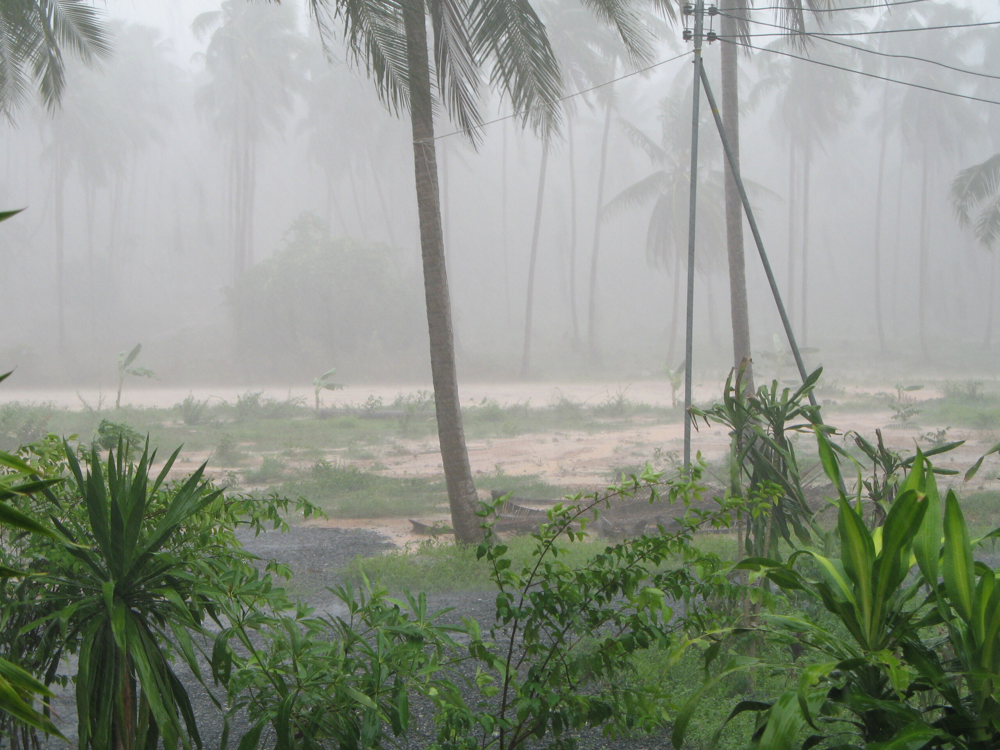

Some rain

Sagte ich schon, dass es derzeit häufiger regnet? Ach so, ja. Gerade geht wieder ein kleiner Schauer runter. Mein Feldweg hinterm Haus ist ein reißender Strom. Wenn es nicht regnet (war heute mal mit dem Moped zum Bankautomaten gefahren (unverrichteterdings)) dann ist der Weg ein schlammiger von tiefen wassergefüllten Schlaglöchern übersäter Erlebnisparcours.

Mein Hausherr kam eben lachend am Haus vorbeigelaufen und meinte nur "ab naam" (duschen). Hab ihn gar nicht erkannt so nass.

Es blitzt und kracht gleichzeitig (das hab ich lange nicht erlebt, normalerweise blitzt es nur, oder es donnert). So einen andauernden Regen mit Gewittern gabs das letzte Mal im November 2005.

Hinterm Haus, jenseits der Buckelpiste, gibts nun einen See mit nächtlichem Krötenchor. Vor dem Haus tummeln sich abends die Insekten im Licht und die Hunde --- gelangweilt.

Die Regenzeit beginnt übrigens im September.

Morgen mach ich mal eine Rundfahrt, wie unser neues Abwassersystem klarkommt. Die Hälfte des Geldes wurde ja für bunte leere Fusswege in Lamai ausgegeben. [Ein paar Bilder von vergangenen Flutzeiten][1] gibts wie immer bei Flickr.com.

 [1]: http://flickr.com/search/?q=flood&w=85376146%40N00

<!-- grammar-ignore ERSTE_PERSON_SIN_OHNE_E mach -->
