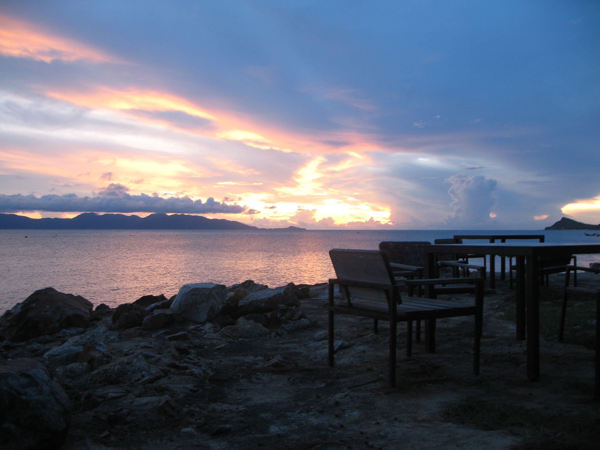

Ab Juli werde ich monatlich Desktophintergründe mit Motiven aus der die schreiBBloga.de für die Desktop-Junkies unter meinen Lesern zur Verfügung stellen.

Den Anfang macht das Bild oben --- ein Sonnenaufgang am Strand von Bang Por hier auf Ko Samui. Ist ein wenig unscharf, es sollte aber nicht zu epileptischen Anfällen kommen. Für zukünftige Hintergründe kann man mir gerne "Anregungen" geben.

### Lizenz

 Die Desktophintergründe sind unter der <a about="urn:sha1:IFJPLI455BJTVQNSBJAJ3FUMCHMNJDJS" rel="license" href="http://creativecommons.org/licenses/by-nc-nd/2.0/de/">Namensnennung-Keine kommerzielle Nutzung-Keine Bearbeitung 2.0 Deutschland</a> Lizenz frei verfügbar und können weiter gegeben werden.

<!-- cspell:ignore Bloga -->
<!-- grammar-ignore DE_CASE Keine -->
