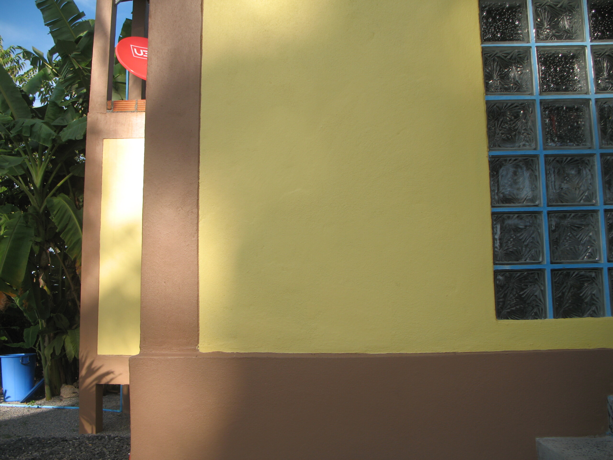

Me now.

Die Geschichte hinter dem Shirt (aufs Bild klicken und bei flickr.com nach links und rechts weg brausen): Vor zwei Jahren bin ich hin und wieder Klamotten kaufen gegangen. Ich dachte mir so, jetzt sind wir in Thailand, da muss man schön cool sein und den Stil mal wechseln. Ich kaufte hier, ich kaufte da, immer XL und nie anprobiert. Das war ein Fehler, denn das thailändische XL ist ein deutsches M, wenn überhaupt.

Und so kam es, dass sich nun auf dem Kleiderschrank im Schlafzimmer eine Reisetasche voller Klamotten befindet, die mir alle zu klein sind. Zurückbringen war keine Option, wer wälzt sich schon fett ins Geschäft und gibt zu, dass man seine Ausmaße falsch bewertet hat.

Neulich nun fand ich Photos aus dem Jahre 2004. Mit mir drauf. Und dann glaubte sogar ich, dass ich "etwas" abgenommen hätte. Vergangenes Wochenende habe ich also mal die Reisetasche entstaubt und Klamotten getestet. Und siehe da, einige passen. Nicht alle, man muss ja noch ein Ziel vor Augen haben.

Dieses Shirt beispielsweise war der pure Horror. Man kriecht da ja von unten rein und als ich das vor zwei Jahren versuchte, blieb ich hängen (bzw. das Shirt um meine Schultern) und ich kam nicht mehr raus. Ich glaube, das waren 5 Minuten, bis ich mit Knacken und Krachen im Stoff und den Knochen wieder befreit auf dem Bett lag.

Wie auch immer. Nur so am Rande. Für euch Fettsäcke da draussen! So. Und jetzt erst mal ein paar Würstchen in die Pfanne hauen …

PS: Und Kontaktlinsen trage ich seit heute auch wieder. Ich muss da ein paar Autorenphotos schießen und halbwegs interessant aussehen. Verwirrung der Massen.

PPS: Mist, da hab ich den ganzen Tag so einen Spruch vorformuliert und dann doch vergessen, ihn hinzuschreiben. Irgendwas mit "stolzgeschwellter Brust die den Bauch weniger ausladend aussehen lässt"...

<!-- grammar-ignore DE_REPEATEDWORDS_NUN nun -->
<!-- grammar-ignore DRAUF drauf -->
