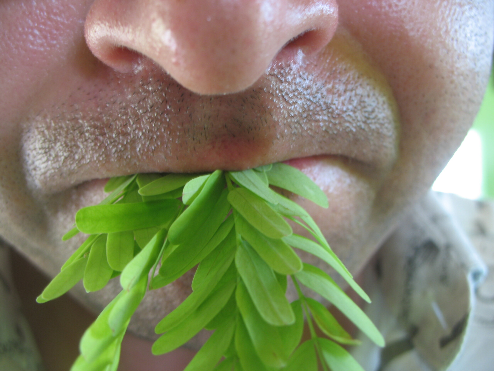

Gesund!

In meinem Garten steht ein großer [Tamarindenbaum][1]. Da hängen Tamarinden dran. Manchmal landen die im Pad Thai, meistens aber in kleinen Süßigkeiten. Viel Zucker und Tamarinden. Lecker.

Interessant sind aber auch die Blätter. Die wurden mir neulich vom Hausherren mit einem aufmunternden "Gin! Aroy!" vor die Nase gehalten. Da er bei solchen Aktionen meist im Rudel auftaucht, starrten mich vier Thaigesichter erwartungsvoll an und ich stopfte mir die Blätter einfach in den Mund. Lecker. Sehr sauer und saftig. Man sollte natürlich nur die jungen grünen Blätter essen.

Seither beiss ich immer mal in den Tamarindenbaum, wenn die Hunde Gassi gehen …

 [1]: http://de.wikipedia.org/wiki/Tamarindenbaum

<!-- cspell:ignore Thaigesichter -->
<!-- cspell:ignore beiss -->
