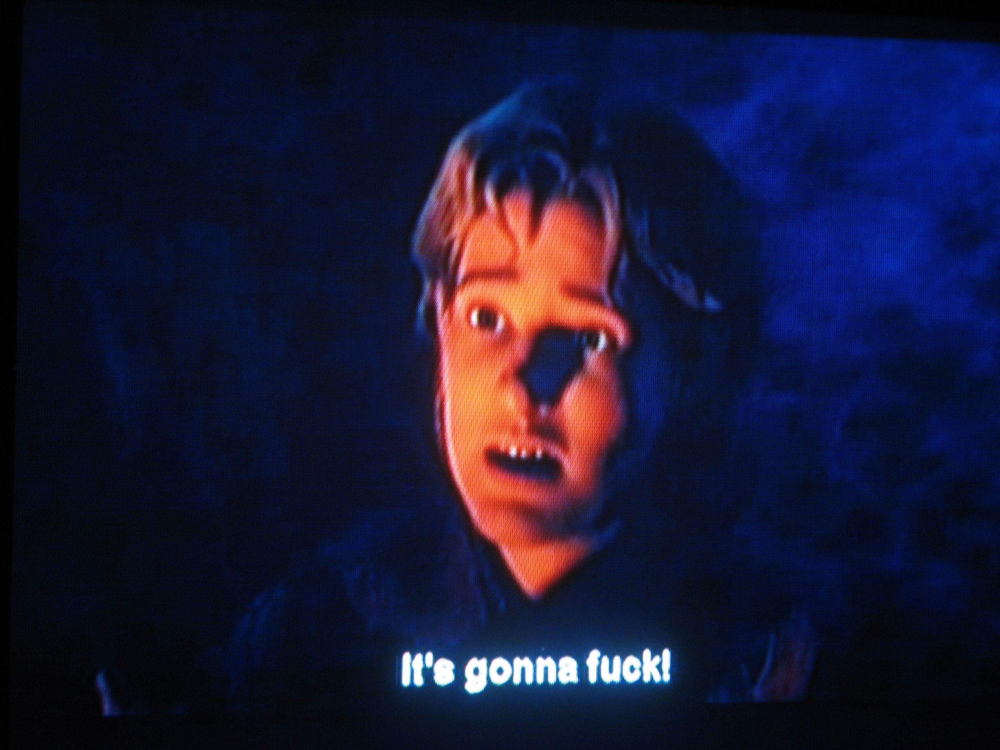

Pirated

Manchmal merkt man beim Betrachten von raubkopierten Filmen, dass jene sicherlich nicht die beste Qualität haben. Beispielsweise, wenn man eine Hand vor der aufnehmenden Kamera sieht. Oder wenn jemand aus der ersten Reihe links mitgefilmt hat und alles leicht isometrische Dimensionen hat. Oder, wie hier, wenn die Untertitel die Englischkenntnisse des Untertitelnden offenbaren. Es ging um einen aus dem Nest fallenden Jungvogel (ich bin mir der Ironie des "Vogels" bewusst). In Shrek 3.

Disclaimer: Der Autor ruft zum Boykott von raubkopierten DVDs auf und hat selbige seit, ehm, 8 Wochen nicht gekauft. Seither geht er regelmäßig ins Kino. Dort kann man kuscheln und das Popcorn ist verdammt lecker. Und die Subtitel sind von studierten Subtitlern geschrieben.

<!-- cspell:ignore Subtitlern -->
<!-- cspell:ignore Untertitelnden -->
