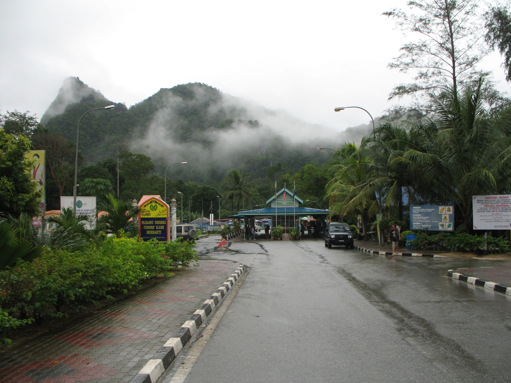

Malaysia

Drüben ist Malaysia, ich stehe direkt auf der Grenze.

Die malaysischen Grenzbeamten versuchen immer, die blonden "Chicks" im Visarun-Verband zu längeren Aufenthalten zu überreden. "Next time you stay longer".

Sicher. Malaysia hat ein Visa on arrival von 90 Tagen. Entspricht genau der Sperrdauer in der 180-Tage-Regel für VoAs im Land der Freien.
