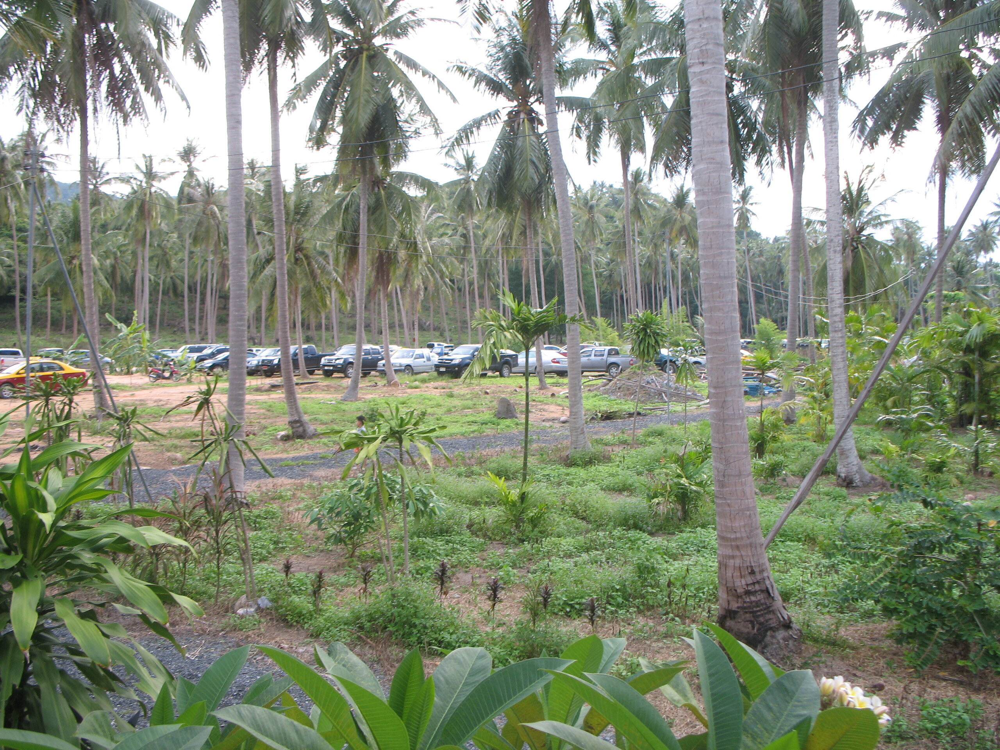

Something happens …

Irgendwas ist im Busch, mal kolonialdeutsch buchstäblich gesprochen. Seit gestern Morgen wurde gegenüber auf dem Büffelkampfplatz eine Krachmach-Anlage aufgebaut (im 24/7-Test mit Luk-Tung-Musik getestet). Seit einer guten Stunde redet einer immer einen Satz und alle jubeln, johlen, schreien, pfeifen, schimpfen oder machen andere Geräusche. Unser Sandplatz ist voller Autos (ein Verkehrsaufkommen ungefähr 10-mal größer als bei Stierkampfveranstaltungen). Was das der Natur wieder antut ;)

Entweder es ist eine Party (darauf deuten die gerösteten Gerüche und die Abwesenheit der üblichen Personen im Umkreis, die sich nur durch Beer Chang locken lassen) oder eine Demonstration (die Stimmen deuten dann schon eher auf eine thaitypische Demo hin).

Mal sehen, werd mal vorbeisehen gehen.

PS: 18:30 Uhr und schon ist alles vorbei. Das war mal wieder sehr seltsam. Sehr, sehr seltsam. Mal die Informanten ansetzen was da los war …

<!-- cspell:ignore Büffelkampfplatz -->
<!-- cspell:ignore Krachmach -->
<!-- cspell:ignore thaitypische -->
