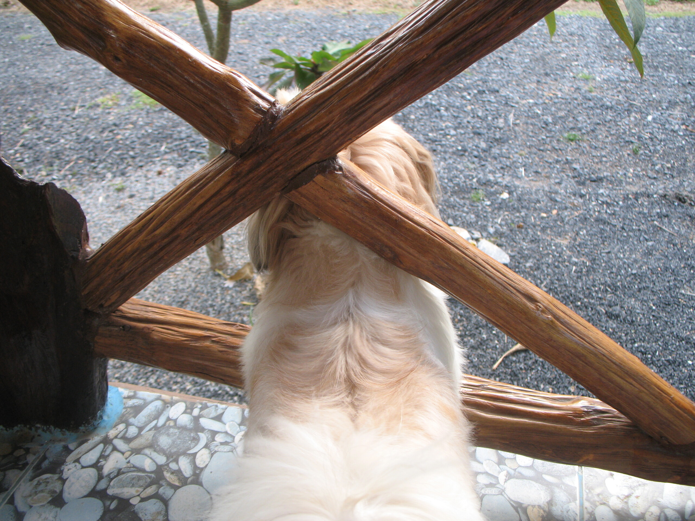

Eben hat sich der grosse verrückte schwarze Hund (genau der) wieder losgerissen und versucht, den kleinen schwarzen Hund zu beissen. Der kleine schwarze Hund ist der neue Hund meiner Hausherren, schwarz, 6 Monate alt und doppelt so groß wie Pokki. Trotzdem ist er "sowas" wie der Freund von Pokki und versucht trotz Pokkis Gekläffe und Aufregung bei Kontakt mit ihm zu spielen. Pokki rennt ihm dann hinterher und bellt und regt sich sehr auf, wackelt aber schon mal mit dem Schwanz. Der kleine schwarze Hund versteckt sich dann immer hinter Grasbüscheln und Pokki übersieht ihn. Ob absichtlich oder nicht weiß ich nicht so genau.

Jedenfalls raschelte es draußen, dann jaulte der kleine Schwarze, dann bellte Pokki, dann kläffte Soosie (die immer kläfft, wenn Pokki bellt, denn Pokki ist ja der Große und der muss ja wissen, wann man bellen muss), dann bellten zwei drei andere Hunde aus der Umgebung und dann kamen sie alle angerannt. Die Hundepolizei der Umgebung. Das sind 15 große Hunde, die den großen verrückten schwarzen Hund das letzte Mal fast tot gebissen haben. Was knabbert er auch die Tiere der Umgebung an.

Dann wird gekläfft und gefletscht und Pokki und Soosie drehen am Rad. Wie stellen uns dann auf die Veranda, ich die Hunde fest unterm Arm und beobachten das Spektakel. Der süße Thainachbar kommt dann schnell und versucht den großen verrückten schwarzen Hund an der Kette gen heimatlicher Hütte zu führen. Die Hundepolizei markiert noch ein bisschen Revier und das Spektakel ist vorbei.

Fast.

Pokki muss nun alle Palmen wieder anpinkeln, damit die anderen Hunde wissen, dass das hier _sein_ Revier ist. Hab gleich mal Wasser nachgefüllt. Nachher wird er dann geschäftig rumrennen und alles, was sich irgendwie in Pinkelhöhe über dem Boden erhebt, befeuchten.

PS: Das Photo oben ist etwas älter.

<!-- grammar-ignore FRAGEZEICHEN_STATT_PUNKT . -->
<!-- grammar-ignore RAN_RUM_RAUF_REIN_RAUS_RUNTER_NEU rumrennen -->
<!-- cspell:ignore Pinkelhöhe -->
<!-- cspell:ignore Thainachbar -->
