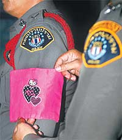

Ich werde das dumpfe Gefühl nicht los, dass die Königliche Thailändische Polizei gerade dabei ist, sich weltweit sehr sehr lächerlich macht.

Die beste Überschrift zum Thema ist folgende: [Less-than-purr-fect Thai Police To Sport Hello Kitty Armbands As Punishment][1] und sagt eigentlich schon alles. [Schlechte Polizisten müssen ab sofort eine pinke Armbinde mit Hello-Kitty-Katze tragen][2]. 10 Armbinden gibt es in Bangkok und Polizisten, welche die Binde als Disziplinarmaßnahme tragen müssen am ersten Tag im gesamten Revier arbeiten, damit sie von allen Kollegen mit Binde gesehen werden. Mal sehen, ob es ausreicht.

> This new approach is intended to engender a feeling of guilt and discourage them from repeating the offence.

Mal abgesehen von der vermutlichen Urheberrechtsverletzung ist das eher lächerlich als nützlich.

 [1]: http://e.sinchew-i.com/content.phtml?sec=2&artid=200708060021
 [2]: http://bangkokpost.com/News/06Aug2007_news02.php
