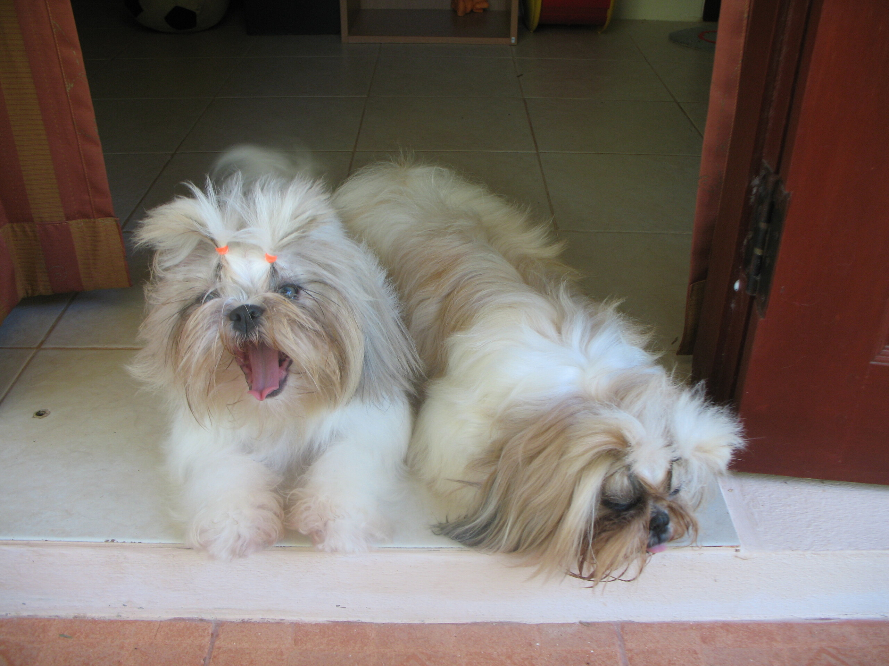

Brushed and clean

Am Sonntag war es mal wieder so weit und ich habe die Hunde ins Hundespa gebracht. Gezwungenermaßen. Ihr Fell war so verfilzt, dass es mit herkömmlichen Mitteln (Kämme, Bürsten, Öle, Wasser) nicht mehr zu retten war. Ich habs gut zwei Wochen versucht, die kleinen Testobjekte haben dabei aber immer mehr Haare lassen müssen.

Also ging es Sonntagmorgen in den Hair Dog Shop. Dort angekommen betrachteten die beiden Friseusen das Malheur und unterhielten sich. "Tat phom" meinten sie, was "Haare schneiden" heißt. Ich bin gleich eingefallen "Mai tat!!" und habe meinen treusten Hundeblick aufgelegt. Nach einigem Hin und Her hatte ich sie dann auch so weit, nicht zu schneiden.

Die nächste Hürde war der Preis. Sie wollten einfach nicht mit einem Preis rausrücken. Normalerweise zahle ich pro unverzottelten Schmutzhund 300 Baht (rund 7 Euro). Beim letzten Filz-Notfall haben sie 700 Baht pro Filzball genommen. Also plante ich jetzt (es war schlimmer als damals) 1000 Baht pro Hund ein. Die Englisch sprechende Friseuse meinte "Äkkspänsiff!". Ich sagte "Thats ok. I pay everything." Sie meinte "Riiiiilih äkksänsiff!" ich erwiderte "Mai pen rai!" und dann sagte sie: "600 Baht." Pause. Pause. "Each dog!". Dann (der dumme Farang könnte das ja falsch verstehen) zeigten sie noch auf jeden Hund und sagten jeweils "600 Baht". Ich verdrückte mir ein Grinsen und gab zu verstehen, dass ich den Umfang begriffen habe und lies die Kleinen jaulend zurück.

Das war morgens um neun, abends um sieben bekam ich zwei flauschig unfilzige lebhafte Fellbündel zurück. Sie wollten mir dann noch kleine Baby-Shi-Tzus andrehen, ich meinte aber, mit diesen beiden hier genug zu tun zu haben.

10 Minuten nach Ankunft zu Hause waren die Schnauzen bereits wieder verdreckt und die Zöpfe schief. Heute Morgen gabs neue Zöpfe. Ich frage mich, wie man Langhaarhunde züchten kann, die Zöpfe nicht mögen. Egal.

Ab sofort wird jeden Morgen der "Barbie --- Jetzt bin ich mein eigener Friseur"-Kasten ausgepackt und Hunde entfilzt.

<!-- grammar-ignore ICH_LIEBS habs -->
<!-- grammar-ignore DOPPELTES_AUSRUFEZEICHEN !! -->
<!-- grammar-ignore RAN_RUM_RAUF_REIN_RAUS_RUNTER_NEU rausrücken -->
<!-- grammar-ignore DE_CASE Jetzt -->
<!-- cspell:ignore phom -->
<!-- cspell:ignore Riiiiilih -->
<!-- cspell:ignore Äkkspänsiff -->
<!-- cspell:ignore äkksänsiff -->
<!-- cspell:ignore unfilzige -->
<!-- cspell:ignore unverzottelten -->
