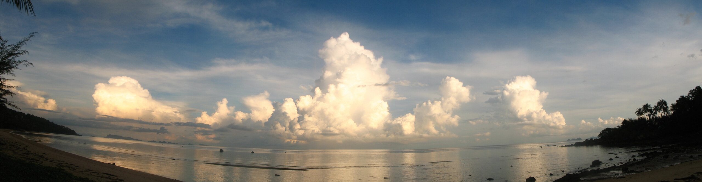

Morning Clouds

Die Erde ist eine Schale. Sag ich mal. Photobeweis oben stehend.

Die Regenzeit ist eine optimale Gelegenheit um Photos zu schießen, die nicht nur die triste Blauer-Himmel-Photokartenromantik der Teilzeit-Samuianer bedienen. Wolken sind was Feines.

Dieses Jahr hat sich der Nord-Ost-Monsun auf einen freundlichen Morgen-Mittags-Frühnacht-Rhythmus eingepegelt. In den vergangenen Jahren konnte man das Wetter so vorhersagen, dass immer dann, wenn ich irgendwohin wollte plötzlicher Regen einsetzte. Wir werden ja sehen …

<!-- grammar-ignore ERSTE_PERSON_SIN_OHNE_E Sag -->
<!-- grammar-ignore DASS_STATT_DAS_RELATIVPRONOMEN dass -->
