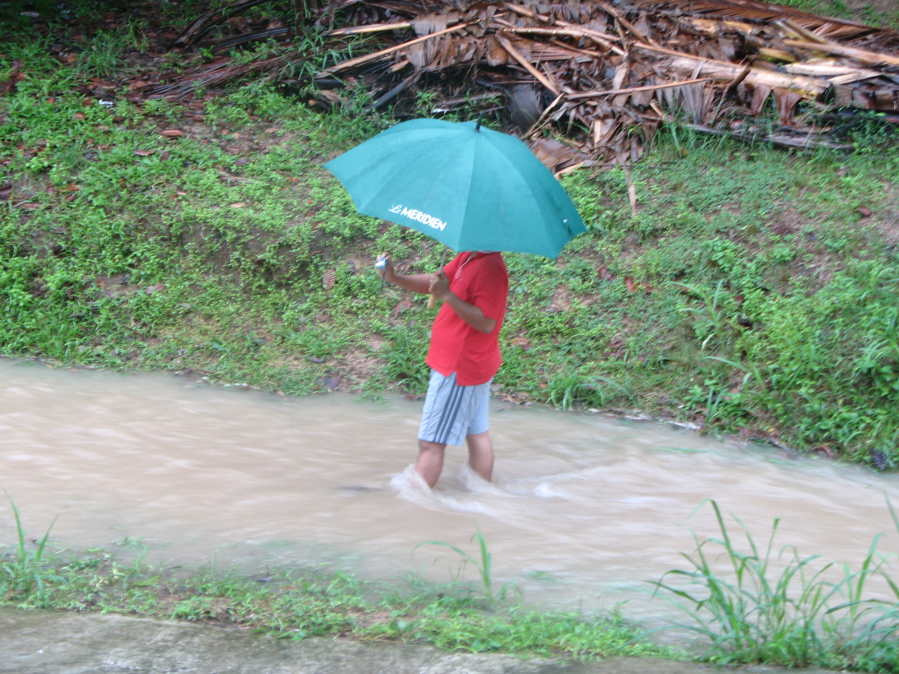

Finally!!!

Das Haus hat seinen Namen "Haus am Klong" nun endlich auch offiziell verdient. Nach den Regenfällen der vergangenen Tage (von ca. 6 Uhr Morgens bis 13 Uhr Mittags) führt der Graben, ich meine, der Klong vor dem Haus Wasser. Viel Wasser. Je nach Wetterlage ist er voll oder flach aber immerhin ein steter Strom. Nachdem die Fluten auch die ganzen Palmenblätter, die von den Gärtnern im Flussbett abgelegt worden sind, hinweggespült haben, ist sogar sowas wie ein kleiner Wasserfall entstanden.

Die Thais der Gegend erfreuen sich am Bangkok-Flair.

Kleiner Nachteil des Hauses: Wie meine beiden regelmäßigen Leser sich erinnern werden --- ich zog um, weil im alten Haus das Energielevel so flach war. Hier im neuen Haus ist der Strom stabil und stark. Wenn er denn da ist. Wir haben Energieausfälle mit jedem Regenguss. Interessanterweise hat der Begriff Regenzeit seinen Namen nicht wegen der großen Trockenheit verdient.

Sehr nervig.

Mein Notebook-Stromkabel hat es bei einem Gewitter heute Morgen auch außer Gefecht gesetzt. Wie gut, dass es immer irgendwelche Farangs in der Nähe gibt, die verschiedene Kabel in Kisten rumliegen haben.

<!-- grammar-ignore DOPPELTES_AUSRUFEZEICHEN !!! -->
<!-- grammar-ignore SUBJUNKTION_KOMMA_2 Wenn -->
<!-- grammar-ignore RAN_RUM_RAUF_REIN_RAUS_RUNTER_NEU rumliegen -->
