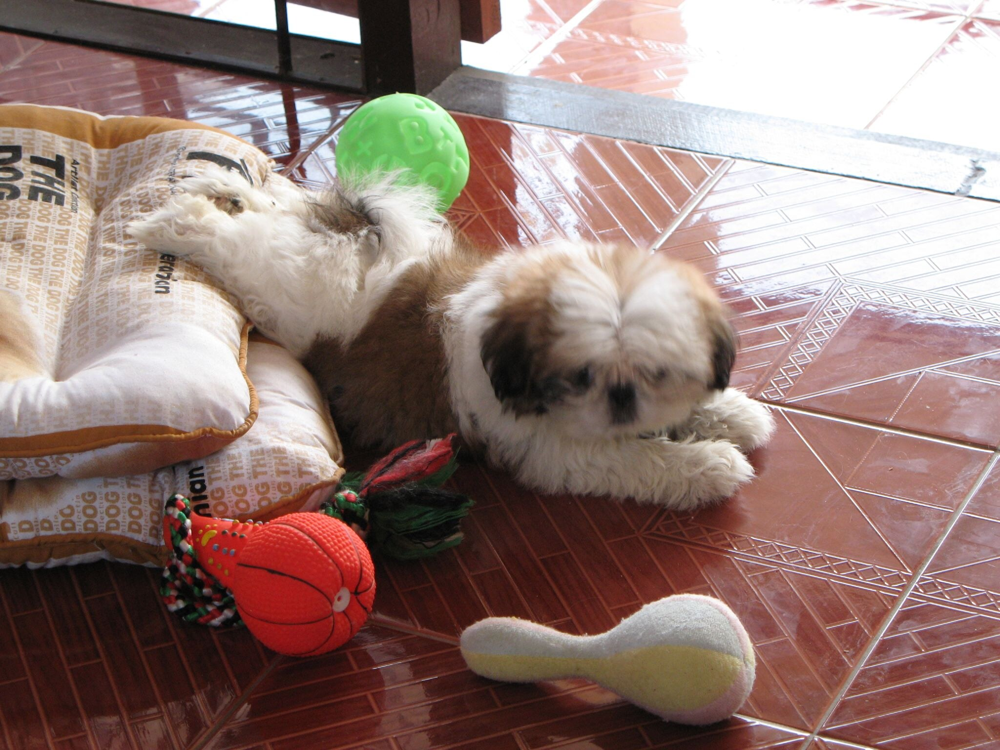

chilling

Der kleine Genosse im Bilde ist seit heute 2 Jahre alt. Er kam zwar erst am 1. Januar 2006 zu mir, wurde aber am 15. November 2005 geboren, der kleine Pokki. (Hundeliebhaber werden nun an zwei Händen herumrechnen und missbilligend die Köpfe schütteln, aber glaubt mir, es war die rechte Zeit, um heim zu kommen, wenn man thailändische Hunde-"Züchter"-Verhältnisse kennt.)

Er hat ne Menge erlebt, mit Soosie eine süße Schwester (ehm, Freundin?) und ist ein richtiger kleiner Macho geworden. Hin und wieder sitzen wir zusammen auf der Couch und freuen uns still über das Sein an sich.

Und falls ihr euch wundert, dass es kein aktuelles Photo gibt: Regenzeit --- Filzfellzeit --- Schlammfeldzeit.

<!-- grammar-ignore UPPERCASE_SENTENCE_START chilling -->
