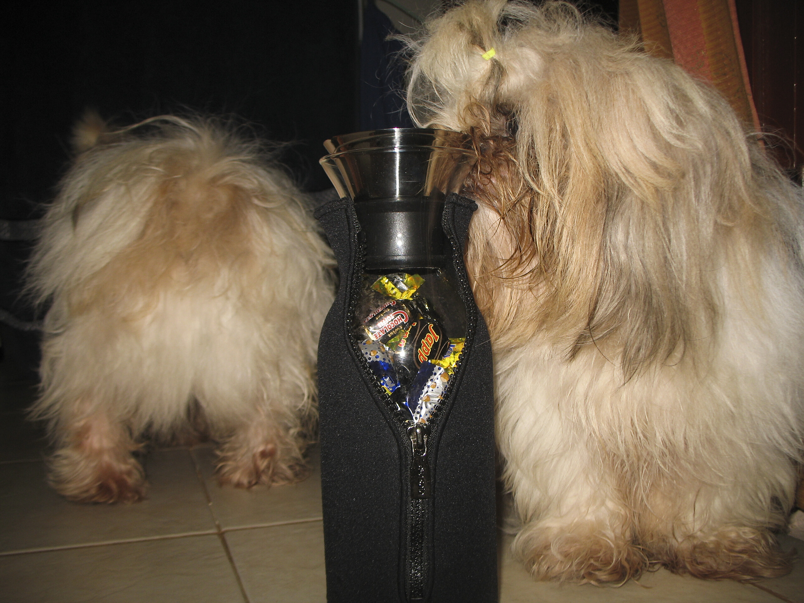

The present from Denmark

Ich bin leicht zu beeindrucken. Da muss man nur einen spülmaschinenfestes, hitzebeständiges Glas in einen Neoprenanzug stecken, ein paar Schokokonfiserien einfüllen, einen patentierten Verschluss, der Ausgießen ohne Vertropfen erlaubt, und ein klares kühles Design zusammenpacken und schon bin ich hin und weg. Ich bin so.

Pokki schnüffelte kurz und schnaubte dann. Soosie schnüffelte etwas länger, schnaubte aber auch. Ich find das Teil Klasse. Mehr Designerkram von Claus Jensen und Henrik Holbæck gibts bei [evasolo.com][1].

PS: Ist eine [Karaffe im Neoprenanzug][2]. Damit der Wein länger kühl bleibt.

 [1]: http://evasolo.com/
 [2]: https://web.archive.org/web/20071021034225/http://www.evasolo.com/products-fridge.html

<!-- grammar-ignore ERSTE_PERSON_SIN_OHNE_E find -->
<!-- cspell:ignore evasolo -->
<!-- cspell:ignore Schokokonfiserien -->
<!-- cspell:ignore Vertropfen -->
