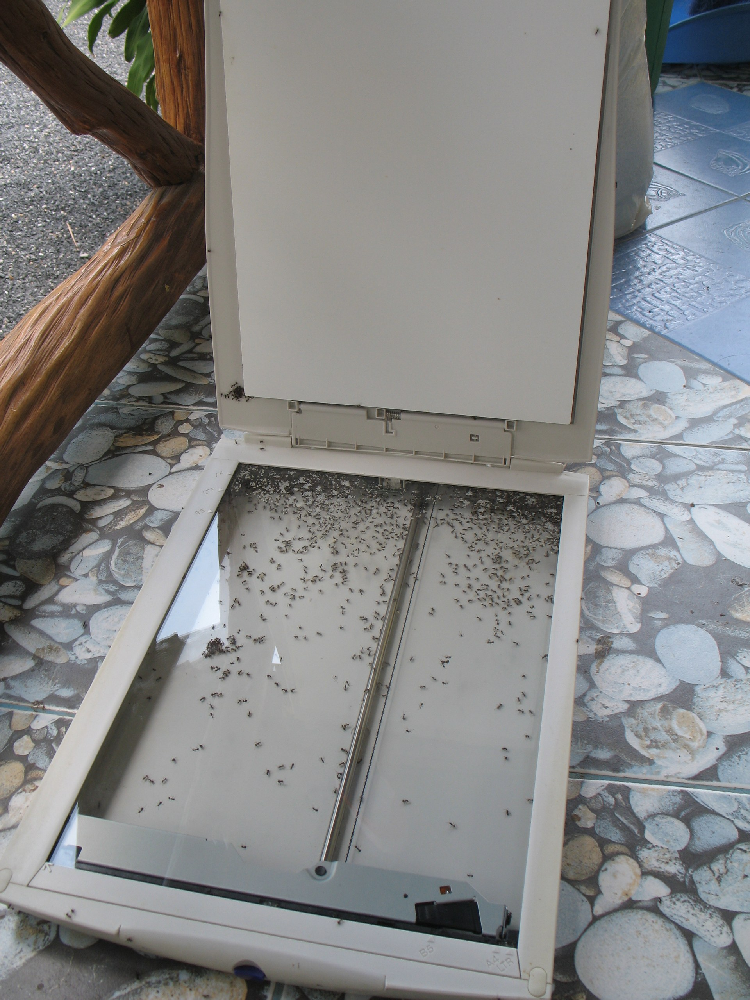

Unter dem Titel [Die Top-10 der Daten-Desaster][1] bringt der Spiegel eine Topliste der Daten-Desaster … Jaja. Auf Platz Eins? Ein Photograph in Thailand:

<!-- vale off -->

> Verwundert darüber, dass sich in seiner Festplatte Ameisen eingenistet hatten, griff ein Fotograf in Thailand zur chemischen Keule. Er öffnete Gehäuse und sprühte Insektenspray ins Innere. Die Ameisen waren damit hinüber, die Daten leider auch.

<!-- vale on -->

Nun, was genau stimmt Leute, die mehr als einen Tag in Thailand zugebracht haben, verwundert über diese Zeilen? Nein, nicht dass der Photograph verwundert über die Ameisen war. Auch nicht, dass die Festplatte durch Ameisenvernichtungsmittel zerstört wurde, nein: Jeder der ein paar Tage in Thailand zugebracht hat, weiß, dass Ameisen Sonne nicht mögen.

Ich habe die [Ameisen im Scanner][2] damals mit einer kleinen Portion Sonnenlicht gekillt. Sonne reicht aus. Ameisenvernichtungsmittel? Na ja. Ich dachte immer, Photographen hätten ein Auge für Details.

<figure id="photo-472175485">

</figure>

 [1]: http://www.spiegel.de/netzwelt/tech/0,1518,522562-9,00.html
 [2]: #photo-472175485

<!-- grammar-ignore DE_CASE Die -->
