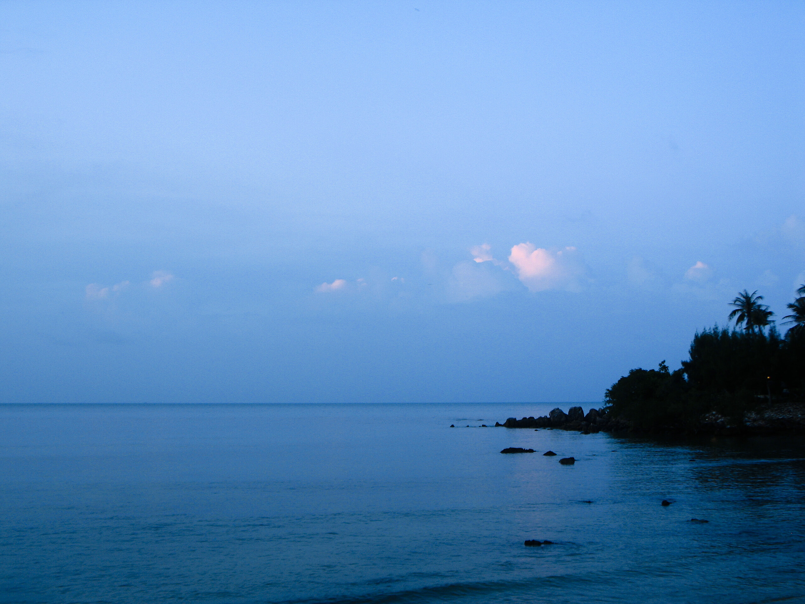

Samui-Samui-Wallpaper January 2551

Für die Freunde der wechselnden Bildschirm- oder Desktophintergründe gibt es dieses Jahr jeden Monat ein Bild. Heute ein Sonnenuntergang am Strand von Bang Por.

### Lizenz

 Die Desktophintergründe sind unter der <a rel="license" href="http://creativecommons.org/licenses/by-nc-nd/2.0/de/">Namensnennung --- Keine kommerzielle Nutzung --- Keine Bearbeitung 2.0 Deutschland</a> Lizenz frei verfügbar und können weiter gegeben werden.

<!-- grammar-ignore DE_CASE Keine -->
