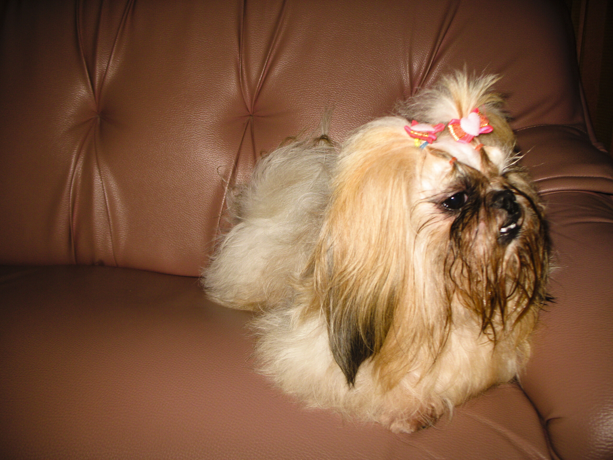

Pokki

Yeah! Heute Morgen im Hundehaarshop haben wir gut 20 Minuten diskutiert, was denn nun mit dem Filzmantel meines Großen zu tun sei. "Cut cut" wurde häufiger gesagt. Ich wollte ja nicht laut sagen, dass ich "alles" zahlen würde, um einen Abschnitt zu verhindern. Nach einer Weile hatten wir uns auf 800 Baht (ein Vermögen in Hunderechnungen gerechnet) geeinigt und ich wurde mit den Worten "it long time" nach Hause geschickt.

Nach langer Zeit (8 Stunden später) durfte ich eben einen absolut filzfreien kleinen Shihtzu in Empfang nehmen. Tja. Was Chemie so alles vermag.

Soosie hat ihren Pokki auch sehr vermisst (als ich alleine zurückkam, rannte sie gut eine Stunde lang hin und her und suchte Pokki überall und kuckte mich verständnislos an) und war sehrsehr froh, ihn endlich wieder zu sehen --- ich wurde glatt ignoriert.

Obiges Bild übrigens zeigt Pokki 5 Minuten nach Ankunft zu Hause. Er liebt es, das Wasser vom Boden des Napfes zu trinken. Sehr unphotogen und irgendwie schade um die vielen Baht …

PS: Irgendwie sieht Soosie jetzt sehr filzig aus … wenn sie so neben Pokki sitzt …

<!-- grammar-ignore GERMAN_WORD_REPEAT_RULE Cut cut -->
<!-- cspell:ignore sehrsehr -->
<!-- cspell:ignore unphotogen -->
