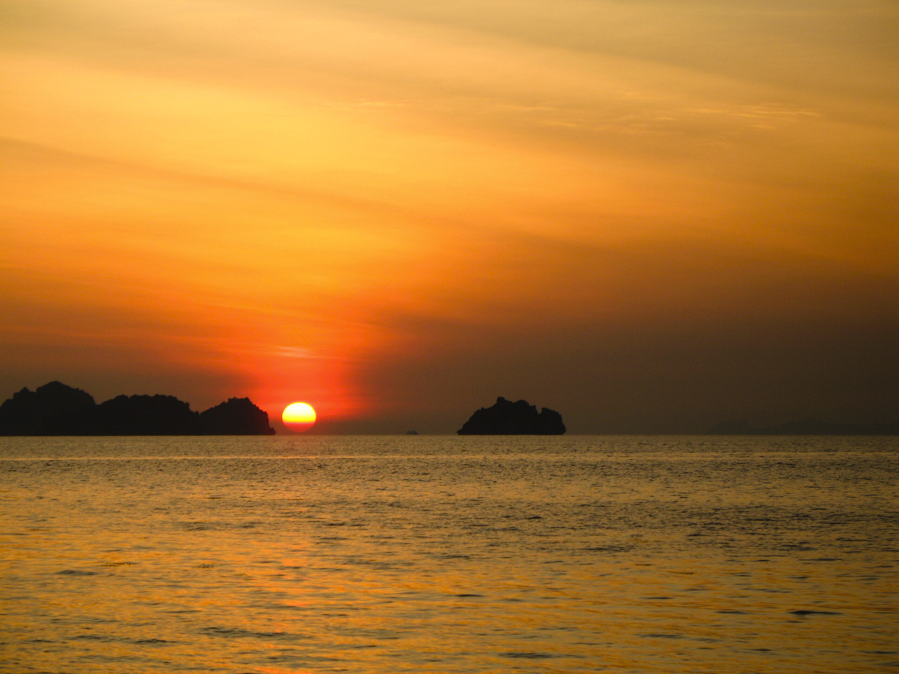

Samui-Samui-Wallpaper January 2551 II

Für die Freunde der wechselnden Desktop- und Bildschirmhintergründe gibt es dieses Jahr jeden Monat ein Bild. Oder zwei. So wie diesen Monat. Heute ein Sonnenuntergang am Strand von Ban Taling Ngam. _Dem romantischen Sonnenuntergangsstrand Koh Samuis_.

Ich nehme natürlich an, dass ihr von Sonnenuntergängen so langsam genervt seid, also werde ich das nächste Mal ein anderes nicht uninteressanteres Motiv finden.

### Lizenz

 Die Desktophintergründe sind unter der <a rel="license" href="http://creativecommons.org/licenses/by-nc-nd/2.0/de/">Namensnennung --- Keine kommerzielle Nutzung --- Keine Bearbeitung 2.0 Deutschland</a> Lizenz frei verfügbar und können weiter gegeben werden.

<!-- grammar-ignore DE_CASE Keine -->
<!-- cspell:ignore Sonnenuntergangsstrand -->
