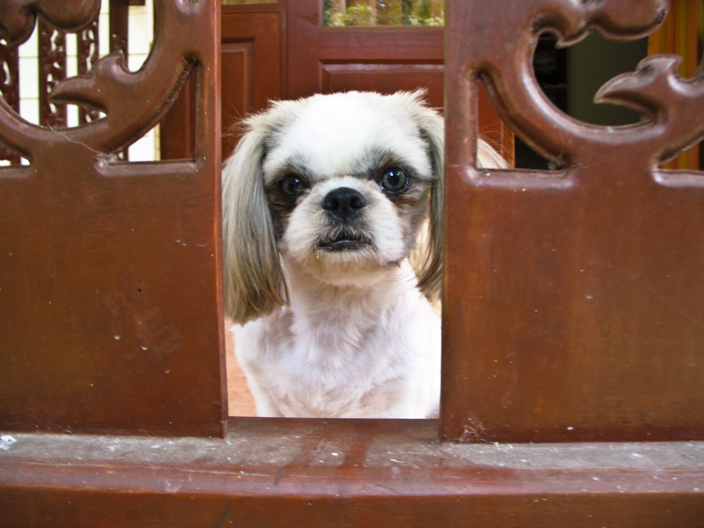

The thinker

Jahaaaaaa. Also: Ein kleiner Shih-Tzu wurde vergangene Woche um seine Haare gebracht. So stolz sind wir _alle_ nicht darauf, aber auf allgemeine Forderung Einzelner hier ein aktuelles Photo von Soosie (man möge den Dreck auf der Veranda übersehen).

Ich persönlich finde ja, dass Soosie mit kurzen Haaren immer besonders süß aussieht und werde sie vielleicht etwas kürzer halten. Die langen Haare fielen übrigens einer Filz- und Bug-Invasion zum Opfer. Innerhalb einer Woche war sie verfilzt wie ein Filzschuh und jede Menge kleiner Beisskäfer haben sich in der Haut verbissen. Der Dschungel hinter dem Nachbarhaus ist kein guter Spielplatz für einen Shih-Tzu. Das haben wir beide nun gelernt.

Pokki ist immer noch langhaarig und hat den Dschungel stets gemieden. Clever dog :)

<!-- cspell:ignore Jahaaaaaa -->
<!-- cspell:ignore Beisskäfer -->
