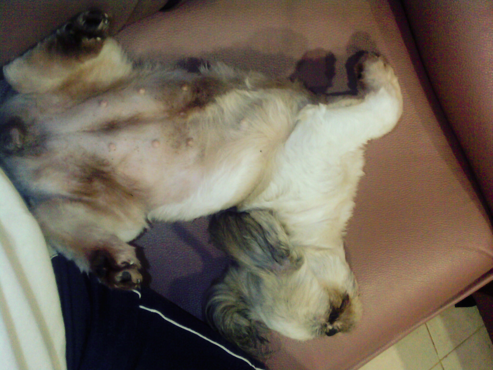

Day 60

Nach [Helgas Link][1] neulich bin ich nun zu sagen wir 89 % überzeugt, dass Soosie schwanger ist. Sehr kuschelig ist sie seit einigen Wochen, sie frisst weniger aber öfter, leckt sich ständig und bei einem fachmännischen Test am Unterleib vermeinte ich Bewegungen zu spüren.

Sollte es denn so weit sein, dann ist es nun so weit. In wenigen Minuten beginnt der wichtige Tag 60 und wir werden sehen, ob innerhalb der nächsten 6 Tage kleine Hundebabys purzeln werden.

Ich habe die Ecken neben der Couch brav mit einer Wurfkiste und einem neuen Hundenest ausgebaut, Milchpulver und Vitaminpaste gekauft. Die Wurfkiste ist eine unserer Umzugskisten (wir haben Plastikkisten so 30 × 20 × 20 cm gross) mit vielen Handtüchern ausgestattet und das Hundenest so ein Plastikstoffteil. Soosie mag das Nest. Pokki schlaeft in der Wurfkiste.

Der Hundedoktor ist auf der 2 im Handy gespeichert. Schiefgehen kann eigentlich nichts mehr.

Also entweder stecken da zwei kleine Hunde drinnen oder einer, der relativ schnell von einer Ecke zur anderen rutscht oder wir haben uns einfach nur getäuscht. Wieder.

Mal sehen.

 [1]: https://web.archive.org/web/20080316085943/http://www.lilly-und-motte.de/blog/index.php?/categories/60-Traechtigkeit

<!-- grammar-ignore DE_REPEATEDWORDS_NUN nun -->
